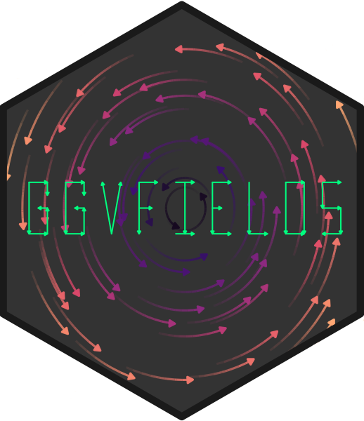

  
  <!-- README.md is generated from README.Rmd. Please edit that file -->
  
```{r, include = FALSE}
knitr::opts_chunk$set(
  collapse = TRUE,
  comment = "#>",
  fig.path = "man/figures/README-",
  out.width = "100%",
  dev = "png", dpi = 300,
  fig.height = 3.5
)
```

# ggvfields  

`r badger::badge_repostatus("Active")`

**ggvfields** is a powerful package for visualizing vector fields, stream plots, and related visualizations. It provides tools to explore directional data, including options for vector smoothing, gradient fields, potential visualizations, and dynamic flow representations.

## Installation

Install **ggvfields** directly from GitHub:
  
```{r eval = FALSE}
remotes::install_github("dusty-turner/ggvfields")
```

Load the package in R:
  
```{r}
library("ggvfields")
options(ggplot2.continuous.colour="viridis")
```

Generate sample wind data:
  
```{r}
set.seed(1234)
n <- 10

wind_data <- data.frame(
  lon = rnorm(n), 
  lat = rnorm(n), 
  dir = runif(n, -pi/4, pi/4),
  spd = rchisq(n, df = 2)
) |> 
  within({
    fx    <- spd * cos(dir)          # Compute the x-component of the vector
    fy    <- spd * sin(dir)          # Compute the y-component of the vector
    xend  <- lon + fx                # Compute the end x-coordinate
    yend  <- lat + fy                # Compute the end y-coordinate
  })

round(wind_data, digits = 2) 
```

---
  
## Core Features

### `geom_vector` and `geom_vector2`

These functions allow for flexible visualizations of vector data.

- **`geom_vector`**: By default, this maps the norm (magnitude) of a vector to its color.  This helps compare relative magnitudes visually through color gradients. Users do not need to explicitly specify this unless overriding the default behavior.

```{r}
ggplot(wind_data) +
  geom_vector(aes(x = lon, y = lat, xend = xend, yend = yend)) 
```

`geom_vector` also supports both `xend`/`yend` format as well as `dx`/`dy` format.

```{r}
ggplot(wind_data) +
  geom_vector(aes(x = lon, y = lat, fx = fx, fy = fy)) 
```

- **`geom_vector2`**: Maps the norm of a vector directly to its length.  This provides a more intuitive representation of magnitude. This is done by mapping `length = after_stat(norm)` by default.

```{r}
ggplot(wind_data) +
  geom_vector2(aes(x = lon, y = lat, fx = fx, fy = fy)) 
```

#### Why Length Mapping Matters

Mapping vector lengths to their norms allows viewers to immediately understand magnitude differences without relying solely on color.

The norm $\mathbf{w} = (u, v)$ is calculated $$|\mathbf{w}| = \sqrt{u^2 + v^2}$$ .

This feature of `geom_vector2` enhances interpretability by using actual vector lengths to represent magnitude. The legend reflects the scaling and ensures consistent interpretation.


#### Polar Coordinates Support

Both `geom_vector` and `geom_vector2` also support polar coordinates, where vectors are specified using magnitude (`distance`) and direction (`angle`). Instead of providing Cartesian components (`dx`, `dy` or `xend`, `yend`), users can directly supply polar data. This feature simplifies workflows for directional data and works  for all subsequent relevant functions that handle polar coordinates.

Polar coordinates can be visualized like this:

```{r}
ggplot(wind_data) +
  geom_vector(aes(x = lon, y = lat, distance = spd, angle = dir)) 
```

#### Normalize and Center

Two important options in `geom_vector` and subsequent functions are `normalize` and `center` - both of which default to `TRUE.` These options help control the visual representation of vectors:

- `normalize`: When set to `TRUE`, this option scales each vector to have a unit length, which can help avoid overplotting in dense vector fields. This is especially useful when the direction of vectors is more important than their magnitude. However, it’s important to note that normalize is different from mapping the norm of the vector to the length aesthetic. While normalization ensures that all vectors are visually uniform in length, mapping the norm to length preserves the relative differences in magnitude by varying the vector lengths based on their actual norms.

- `center`: By default, `center` is also set to `TRUE`, meaning the midpoint of each vector is placed at the corresponding (`x`, `y`) coordinate, effectively "centering" the vector on the point. When center is `FALSE`, the base of the vector is anchored at the (`x`, `y`) point, and the vector extends outward from there. 

The example below turns off this default behavior:

```{r}
ggplot(wind_data) +
  geom_vector(aes(x = lon, y = lat, fx = fx, fy = fy), center = FALSE, normalize = FALSE) 
```


### `geom_vector_field` and `geom_vector_field2`

- **`geom_vector_field`**: Computes vector fields from a user-defined function and maps the norm to color.

```{r}
f <- function(v) c(-v[2], v[1]) # Define a function for the vector field

ggplot() +
  geom_vector_field(fun = f) 
```

- **`geom_vector_field2`**: Similar to `geom_vector_field`, but maps the norm of vectors to their lengths instead of color.

```{r}
ggplot() +
  geom_vector_field2(fun = f) 
```


#### Automatic Limit Detection

Both `geom_vector_field` and `geom_vector_field2` can automatically determine plot limits based on the function provided. This happens when data exists in previous layers or in the base ggplot object.  This allows the limits to be inferred from context. Customize limits with the `xlim` and `ylim` parameters if needed for more control.

```{r}
ggplot(data = wind_data, aes(x = lon, y = lat, fx = fx, fy = fy)) +
  geom_vector() +
  geom_vector_field(fun = f) # Automatically determines limits based on existing data
```

---
  
## Advanced Features

This section introduces tools for deeper exploration of vector fields, allowing users to analyze properties such as smoothness, uncertainty, gradients, and potential functions. These tools provide mathematical insights into the structure of vector fields and extend visualization capabilities beyond basic representations.

Key capabilities include:

- **Smoothing Vector Fields**: Approximate trends in noisy vector data and compute prediction intervals for uncertainty visualization.  
- **Gradient and Potential Analysis**: Derive gradient fields to study scalar variations and visualize potential functions to identify conservative fields.  
- **Dynamic Flow and Stream Plots**: Model particle trajectories and visualize dynamic behavior in time-dependent fields.  
- **Mathematical Feature Mapping**: Display vector norms, divergence, and curl to highlight flow strength, expansion, and rotational behavior.  

### `geom_vector_smooth`
  
Provides smoothed estimates of vector fields by applying statistical techniques to observed vectors.

Smoothing is performed using a multivariate linear model defined by:

$$
\begin{pmatrix}
\hat{dx} \\
\hat{dy}
\end{pmatrix} = \beta_0 + \beta_1 x + \beta_2 y + \beta_3 xy
$$

where $\beta$ are coefficients estimated by ordinary least squares (OLS). This approach captures linear and interaction effects to approximate the underlying vector field.  This function also creates a prediction interval around the vector specified by the `conf_level` argument and defaults to `.95`.

- **Evaluating Specific Points**:

When evaluation points are provided, smoothing is performed at those locations and prediction intervals can be visualized using either wedges or ellipses to indicate uncertainty.

```{r}
eval_point <- data.frame(x = .5, y = .5) 

ggplot(wind_data, aes(x = lon, y = lat, fx = fx, fy = fy)) +
  geom_vector(aes(color = after_stat(NULL)), normalize = FALSE) +
  geom_vector_smooth(eval_points = eval_point) +
  lims(x = c(-7,10), y = c(-3,3))
```

- **Using Wedges to Visualize Uncertainty**:

```{r}
ggplot(wind_data, aes(x = lon, y = lat, fx = fx, fy = fy)) +
  geom_vector(aes(color = after_stat(NULL)), normalize = FALSE) +
  geom_vector_smooth(eval_points = eval_point, pi_type = "wedge") 
```

- **Grid-Based Smoothing**:
  
```{r}
ggplot(wind_data, aes(x = lon, y = lat, fx = fx, fy = fy)) +
  geom_vector_smooth(pi_type = "wedge") + 
  geom_vector() 
```

- **Custom Grid Resolution**:
  
```{r}
ggplot(wind_data, aes(x = lon, y = lat, fx = fx, fy = fy)) +
  geom_vector_smooth(n = 6, pi_type = "wedge") 
```

- **Altering Confidence Level**

For all options, you can change the confidence level from the default to another value by using the `conf_level` argument. 

```{r}
ggplot(wind_data, aes(x = lon, y = lat, fx = fx, fy = fy)) +
  geom_vector(aes(color = after_stat(NULL)), normalize = FALSE) +
  geom_vector_smooth(eval_points = eval_point, pi_type = "wedge") +
  geom_vector_smooth(eval_points = eval_point, pi_type = "wedge", conf_level = .7) 
```

### `geom_gradient_field` and `geom_gradient_field2`
  
The geom_gradient_field function computes and visualizes gradient fields derived from scalar functions and displays the gradient vector field of a scalar function, $f(x, y)$. The gradient is given by:

$$
\nabla f(x, y) = \left( \frac{\partial f}{\partial x}, \frac{\partial f}{\partial y} \right)
$$

This vector field points in the direction of the greatest rate of increase of the scalar function. The function numerically evaluates these partial derivatives and visualizes the resulting vectors.

- **Gradient Field with Norm to Color**:
  
```{r}
paraboloid_field <- function(v) {
  x <- v[1]
  y <- v[2]
  x^2 + y^2
}

ggplot() +
  geom_gradient_field(fun = paraboloid_field, xlim = c(-10, 10), ylim = c(-10, 10))
```

- **Gradient Field with Norm to Length**:
  
```{r}
ggplot() +
  geom_gradient_field2(fun = paraboloid_field, xlim = c(-10, 10), ylim = c(-10, 10))
```

- **Adjusting Grid Density**:

The `n` parameter adjusts the density of the grid used to evaluate the gradient field. Decreasing `n` reduces the number of vectors which producing a coarser grid while increasing `n` results in a finer grid with more vectors. 

```{r}
ggplot() +
  geom_gradient_field(fun = paraboloid_field, xlim = c(-10, 10), ylim = c(-10, 10), n = 5)
```

### `geom_potential`
  
A potential function represents a scalar field whose gradient produces a vector field. It is used to describe conservative vector fields which exist when the curl of the vector field is 0.  

The `geom_potential` function computes and visualizes the scalar potential function for a given conservative vector field. The input function must represent a 2D vector field and the output is the corresponding potential function. If the input field is not conservative, the function checks this condition numerically based on a tolerance parameter. The tolerance determines how strictly the field must satisfy the conservation condition.

```{r}
conservative_fun <- function(v) {
 x <- v[1]
 y <- v[2]
 c(sin(x) + y, x - sin(y))
}

ggplot() +
  geom_potential(fun = conservative_fun, xlim = c(-2*pi, 2*pi), ylim = c(-2*pi, 2*pi))
```

The tolerance parameter can be adjusted to control the sensitivity of the conservativeness check. Decreasing the tolerance makes the check stricter, while increasing it allows for more numerical error.

```{r}
ggplot() +
  geom_potential(fun = conservative_fun, xlim = c(-2*pi, 2*pi), ylim = c(-2*pi, 2*pi), tolerance = 1e-4)
```

As with other functions, we can increase the granulatity of the visualization with the `n` parameter.

```{r}
ggplot() +
  geom_potential(fun = conservative_fun, xlim = c(-2*pi, 2*pi), ylim = c(-2*pi, 2*pi), n = 50)
```

### `geom_streamplot`
  
The `geom_streamplot` function generates a stream plot layer of a user-defined vector field function. The lines in the plot represent the flow of data points through the vector field.

```{r}
f <- function(v) {
  x <- v[1]
  y <- v[2]
  c(-1 - x^2 + y, 1 + x - y^2)
}

ggplot() +
  geom_streamplot(fun = f, xlim = c(-3, 3), ylim = c(-3, 3)) 
```

The `chop` parameter (defaulted to `TRUE`) allows you to chop the trajectories into segments. This can be useful for better visualization of the streamlines when they are long and complex.

It may be useful to not break up the streamlines.

```{r}
ggplot() +
  geom_streamplot(fun = f, xlim = c(-3, 3), ylim = c(-3, 3), chop = FALSE) 
```

It may also be useful to break up the streamlines into more segments. The scale_stream parameter (defaults to 1) adjusts the segmentation of streamlines by specifying the proportion of the streamline length used to divide it into smaller segments.

```{r}
ggplot() +
  geom_streamplot(
    fun = f, xlim = c(-3, 3), ylim = c(-3, 3),
    chop = TRUE, scale_stream = .9,
  ) 
```


### `geom_flow`
  
The `geom_flow` function generates a flow plot layer for a user-defined vector field function. The lines in the plot represent the flow of data points through the vector field, visualizing the trajectory of particles over time. Each flow line traces where a “marble” would move through the vector field if dropped at a specific starting point, making this an intuitive way to visualize dynamic systems.

By default, the color of each flow line corresponds to time (`t`), meaning the color transitions along the path represent the progression of time. As the flow line evolves, it shows how a particle would move over time if following the vector field. You can change the coloring by mapping aesthetics to other computed measures if needed, but time remains the default.

Flows are computed using the deSolve package’s ODE solver, with the rk4 method (a fourth-order Runge-Kutta method) used for numerical integration. This solver ensures accurate and efficient computation of flow lines, abstracting away complex calculations for the user.

```{r}
ggplot() +
  geom_flow(fun = f, xlim = c(-10, 10), ylim = c(-10, 10))
```

In this example, flow lines evolve according to the vector field defined by `f`. The color along each line will show how the particle moves over time (`t`) within the vector field.

#### Adaptive Parameters

Several parameters in `geom_flow()` are adaptive, meaning they adjust automatically based on the characteristics of the vector field and the plot limits. These adaptive parameters help optimize the flow visualization without requiring manual tuning:

- **`threshold_distance`**: This parameter controls the minimum distance between adjacent flow lines to prevent them from overlapping. If not specified, it is calculated automatically as half the Euclidean distance between adjacent grid points. This ensures the plot remains uncluttered, with flow lines spaced appropriately based on the grid dimensions (`n`) and the axis limits (`xlim`, `ylim`).

- **`iterations`**: This parameter defines the number of time steps for the ODE solver to use when tracing the flow lines. A higher number of iterations results in smoother and more detailed flows. If `iterations` is left as `NULL`, it is computed adaptively based on the value of `T`, ensuring that longer time spans result in more iterations for smoother paths.

These adaptive parameters allow `geom_flow()` to create a well-balanced plot by dynamically adjusting the precision and spacing of flow lines, based on the underlying vector field and plot limits.

#### Example with Custom Parameters

Below is an example where we customize the grid size, number of iterations, and the threshold distance between flow lines:

```{r}
ggplot() +
  geom_flow(
    fun = f, n = c(21, 21), xlim = c(-10, 10), ylim = c(-10, 10),
    iterations = 1000, threshold_distance = 0.5
  ) 
```

## Other Features

This package provides other tools to analyze and visualize mathematical properties of vector fields.  These features allow users to map various mathematical characteristics to visual aesthetics like length and color.

We already introduced mapping norm to color in `geom_vector`, `geom_vector_field`, and `geom_gradient_field` and mapping norm to length in each function's '2' alternates.  We also provide similar ability with a functions curl and divergence.

### Divergence

Divergence is an operation on a vector field that describes how the field behaves at a point—whether vectors "spread out" from a point or "converge" toward it. Locally, the divergence of a vector field $\mathbf{F}$ in $\mathbb{R}^2$ at a particular point measures the "outflowing-ness" or rate of expansion of the vector field around that point. The divergence is a scalar value that can indicate sources (positive divergence) or sinks (negative divergence).

If $\mathbf{F} = \langle F_x(x,y), F_y(x,y) \rangle$ is a vector field, its divergence is defined as:

$$
\text{div} \, \mathbf{F} = \frac{\partial F_x}{\partial x} + \frac{\partial F_y}{\partial y}
$$

To visualize the divergence of the vector field, you can map the divergence to the color aesthetic.

```{r}
ggplot() +
  geom_vector_field(
    aes(color = after_stat(divergence)), 
    fun = f, xlim = c(-10, 10), ylim = c(-10, 10)
  ) 
```

### Curl

Curl is a measure of the rotation or swirling behavior of a vector field at a given point. In two dimensions, the curl of a vector field $\mathbf{F}$ in $\mathbb{R}^2$ is a scalar value that quantifies how much the vectors tend to rotate or circulate around a point. Positive curl values indicate counterclockwise rotation, while negative values represent clockwise rotation.

If $\mathbf{F} = \langle F_x(x,y), F_y(x,y) \rangle$ is a vector field, its curl is defined as:

$$
\text{curl} \, \mathbf{F} = \frac{\partial F_y}{\partial x} - \frac{\partial F_x}{\partial y}
$$

To visualize the curl of the vector field, you can map the curl to the color aesthetic.

```{r}
ggplot() +
  geom_streamplot(
    aes(color = after_stat(curl)), 
    fun = f, xlim = c(-10, 10), ylim = c(-10, 10)
  ) 
```


<!-- ## Features in Development -->
  
<!-- ### Animation with `geom_streamplot` -->

<!-- ```{r animation, cache = TRUE, eval = TRUE} -->
<!-- p <- ggplot() + -->
<!--  geom_streamplot( -->
<!--    aes(rownum = after_stat(rownum)),  -->
<!--     fun = f, xlim = c(-3, 3), ylim = c(-3, 3), -->
<!--  ) + -->
<!--  coord_fixed() + -->
<!--  theme_bw() -->

<!-- anim <- animation_transition(plot = p) +    -->
<!--  gganimate::transition_reveal(rownum) + -->
<!--  gganimate::ease_aes('linear') -->

<!-- gganimate::animate( -->
<!--   anim, nframes = 25, fps = 5, end_pause = 0, renderer = gganimate::gifski_renderer() -->
<!--   ) -->
<!-- ``` -->

<!-- The `mask_shape_type` parameter allows you to specify the mask shape used for streamline generation which influences how the streamlines are placed and how closely they can approach each other. The default mask shape is `"square"`, but you can also use `"diamond"`, `"inset_square"`, or `"circle"`.  During streamline generation, when a streamline enters the specified shape, no other streamlines will enter that region.  -->

<!-- - **Square Mask (default)**: Streamlines are restricted to a grid where each cell is a square. This generally results in evenly spaced streamlines. -->
<!-- - **Diamond Mask**: Streamlines are restricted to a square grid with diamonds inset within each square.  This can create a more dense pattern which can have better visualizations for some functions. - **Inset Square Mask**: Streamlines are restricted to a grid with smaller squares inset within larger squares. This can create a denser and more detailed pattern of streamlines. -->
<!-- - **Diamond Mask**: Streamlines are restricted to a square grid with diamonds inset within each square.  This can create a more dense pattern which can have better visualizations for some functions. - **Circle Mask**: Streamlines are restricted to a grid with inset circles inside the square grid. -->


<!-- ```{r} -->
<!-- ggplot() + -->
<!--   geom_streamplot(aes(group = after_stat(id)), -->
<!--                   fun = f, xlim = c(-3, 3), ylim = c(-3, 3), max_length = 10000, -->
<!--                   max_steps = 10000, ds = .05, min_dist = .25,  -->
<!--                   mask_shape_type = "diamond") + -->
<!--   coord_fixed() + -->
<!--   theme_minimal() -->
<!-- ``` -->

<!-- ### `geom_complex_function()`{.R} -->

<!-- The `geom_complex_function()`{.R} function generates a vector field plot layer using a user-defined function to compute the vector components. This function abstracts away the mathematical computations required to generate the vector field, so the user does not need to manually calculate and input the vector components into `geom_segment()`{.R}. It simplifies the process, making it easier to create vector field visualizations without dealing with the underlying math. -->

<!-- ```{r} -->
<!-- f <- function(z) (z^2 + 1) / (z^2 - 1) -->

<!-- ggplot() + -->
<!--   geom_complex_function(fun = f, relim = c(-2, 2), imlim = c(-2, 2), n = 100) + -->
<!--   labs(x = "Real", y = "Imaginary") + -->
<!--   coord_fixed() + -->
<!--   theme(legend.box = "horizontal") -->
<!-- ``` -->

<!-- We can enhance this plot with a little help from biscale. -->

<!-- Using biscale, we can apply a bivariate color scale to the plot, which allows us to represent two variables—angle (direction) and magnitude (intensity)—simultaneously. This makes it easier to visualize how these properties change across the field. -->

<!-- ```{r} -->
<!-- library(biscale) -->
<!-- library(cowplot) -->

<!-- plot <- -->
<!--   ggplot() + -->
<!--   geom_complex_function(aes(fill = after_stat(bi_class)), -->
<!--     fun = f, relim = c(-2, 2), imlim = c(-2, 2), n = 100 -->
<!--     ) + -->
<!--     bi_scale_fill(pal = "DkBlue") + -->
<!--     labs( -->
<!--       title = "", -->
<!--       x = "Real (Re)", -->
<!--       y = "Imaginary (Im)" -->
<!--     ) + -->
<!--     bi_theme(base_size = 16) + -->
<!--     theme(legend.position = "none") + -->
<!--   coord_fixed()  -->

<!-- legend <- bi_legend(pal = "DkBlue", -->
<!--                     xlab = "Angle", -->
<!--                     ylab = "Magnitude", -->
<!--                     size = 6) -->

<!-- ggdraw() + -->
<!--   draw_plot(plot, 0, 0, .8, 1) +   -->
<!--   draw_plot(legend, x = .55, y = .6, width = .3, height = 0.3) -->
<!-- ``` -->


## License

This package is licensed under the MIT License.

## Contact

For questions or feedback, please [open an issue](https://github.com/dusty-turner/ggvfields/issues/new).

## Related Projects

- [ggquiver](http://pkg.mitchelloharawild.com/ggquiver/): Quiver plots for vector fields.
- [ggarchery](https://github.com/mdhall272/ggarchery): Arrow segment visualizations.
