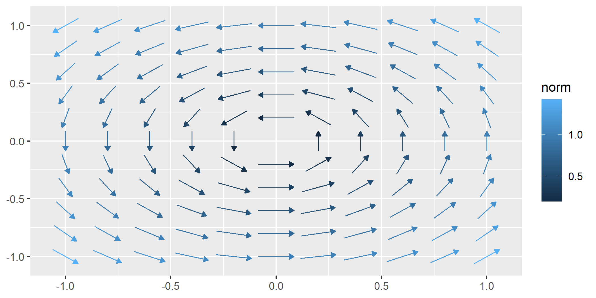
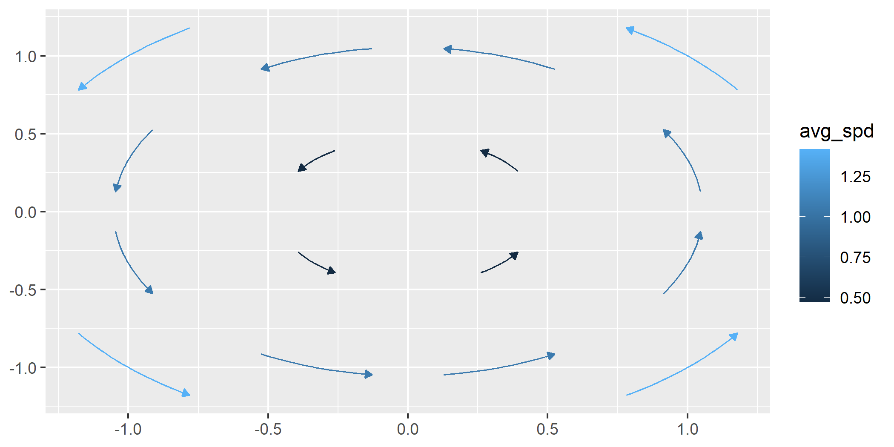
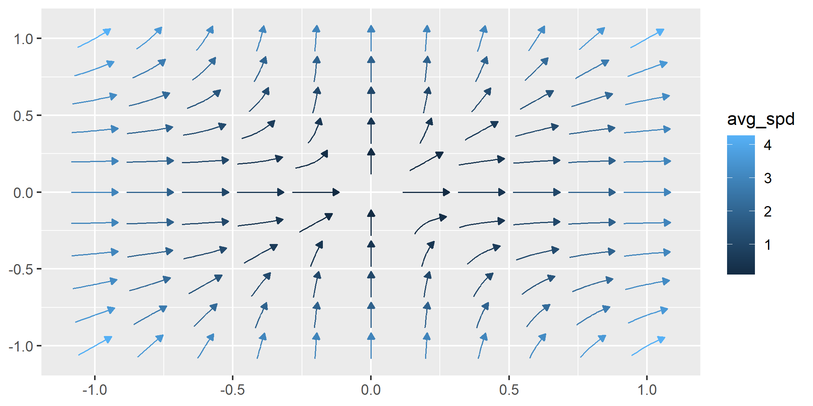
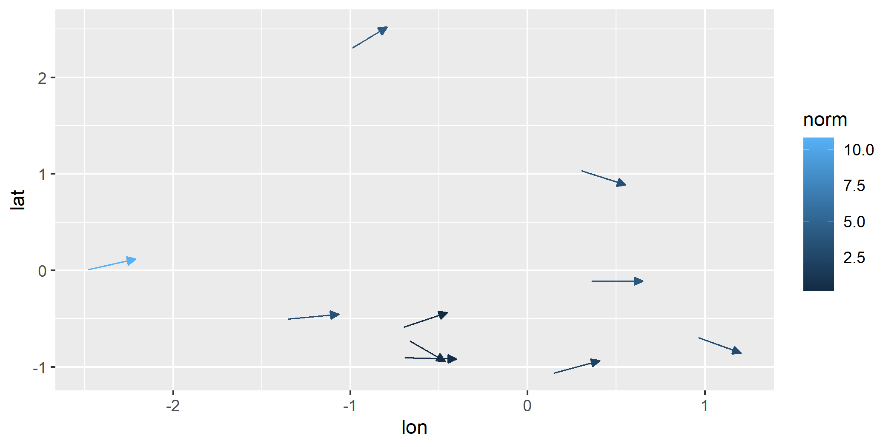
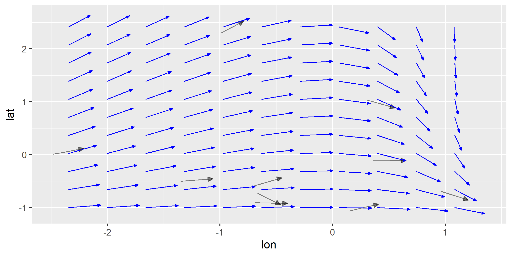
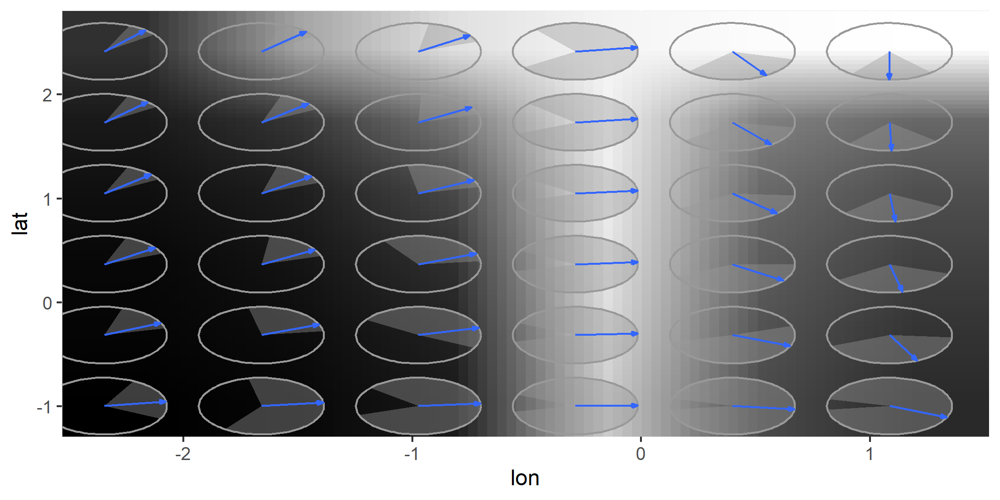
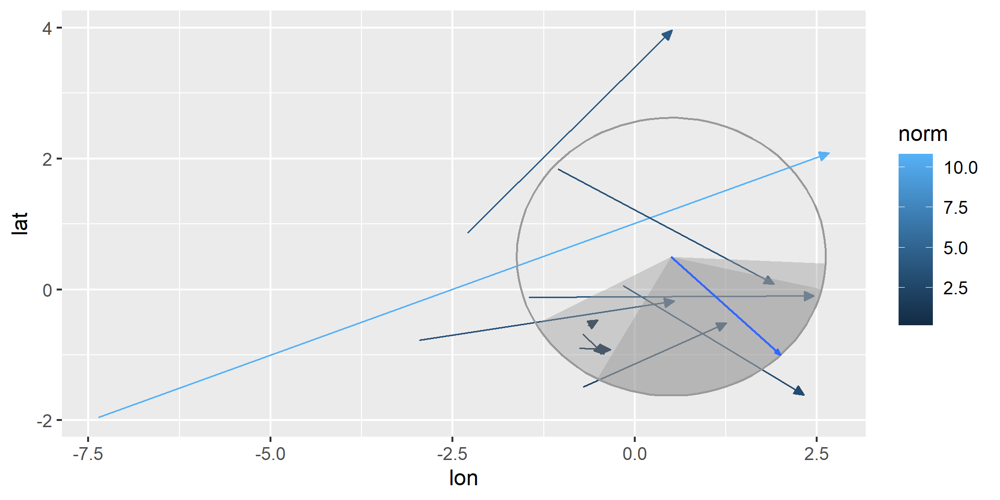
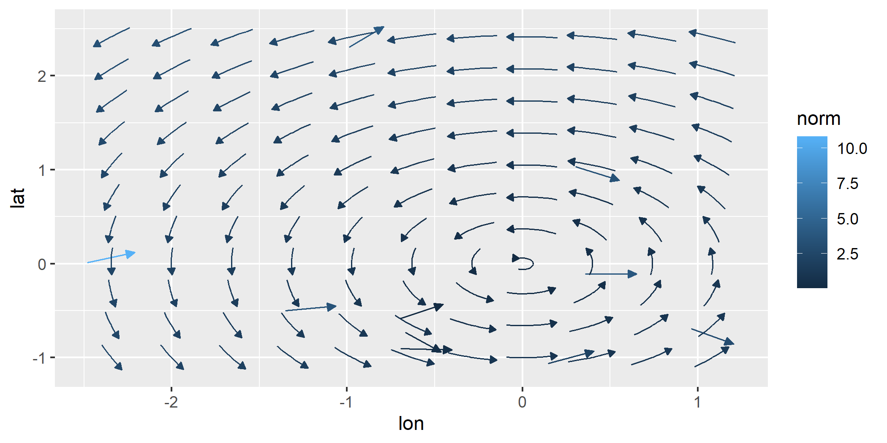
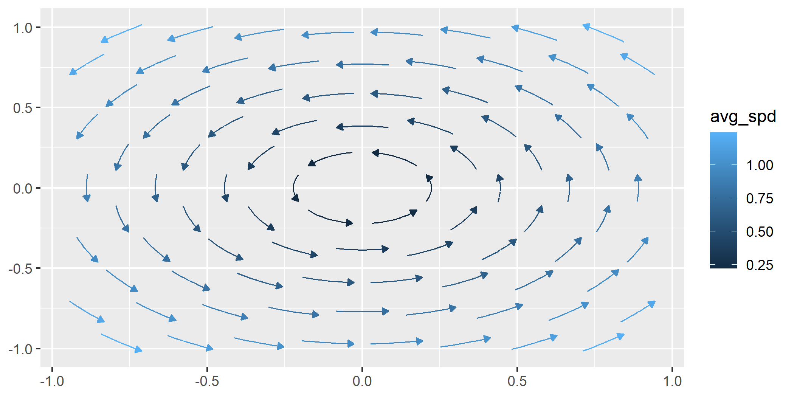

<!-- README.md is generated from README.Rmd. Please edit that file -->

# ggvfields 

[](https://CRAN.R-project.org/package=ggvfields)
[](https://cran.r-project.org/web/checks/check_results_ggvfields.html)
[](https://www.repostatus.org/#active)
[](https://app.codecov.io/gh/dusty-turner/ggvfields)

<!-- [](https://cran.r-project.org/package=ggvfields) [](https://r-pkg.org/pkg/ggvfields) -->
<!-- [](https://github.com/dusty-turner/ggvfields) -->
<!-- badger::badge_doi() -->

**ggvfields** extends
[**ggplot2**](https://github.com/tidyverse/ggplot2) by providing suite
of tools to visualize vector and stream fields. In addition to standard
vector and stream plotting, **ggvfields** automatically computes and
visualizes smoothed vector fields, smooth gradient fields, gradient
fields derived from scalar functions, and potential fields from
gradients. This integrated framework simplifies the analysis and
interpretation of complex vector and scalar field data.

A manuscript describing the theoretical foundations and detailed
methodologies behind ggvfields is forthcoming.

## Installation

**ggvfields** is available on CRAN and can be installed with:

``` r
install.packages("ggvfields")
```

Alternatively, you can install the latest development version from
[GitHub](https://github.com/dusty-turner/ggvfields) with:

``` r
remotes::install_github("dusty-turner/ggvfields")
```

Load the package in R:

``` r
library("ggvfields")
#> Loading required package: ggplot2
options(ggplot2.continuous.colour="viridis")
```

<!-- - [Installation](#installation) -->
<!-- - [Core Features](#core-features) -->
<!--   - [geom_vector and geom_vector2](#geom_vector-and-geom_vector2) -->
<!--   - [geom_stream_field and geom_stream_field2](#geom_stream_field-and-geom_stream_field2) -->
<!--   - [geom_vector_field and geom_vector_field2](#geom_vector_field-and-geom_vector_field2) -->
<!--   - [geom_gradient_field and geom_gradient_field2](#geom_gradient_field-and-geom_gradient_field2) -->
<!--   - [geom_potential](#geom_potential) -->
<!-- - [Advanced Features](#advanced-features) -->
<!--   - [geom_stream_smooth](#geom_stream_smooth) -->
<!--   - [geom_vector_smooth](#geom_vector_smooth) -->
<!--   - [geom_gradient_smooth](#geom_gradient_smooth) -->
<!-- - [Other Features](#other-features) -->
<!--   - [Automatic Limit Detection](#automatic-limit-detection) -->
<!--   - [Custom Grids](#custom-grids) -->

------------------------------------------------------------------------

## Core Features

### `geom_vector_field()` and `geom_vector_field2()`

- **`geom_vector_field()`**: Computes vector fields from a user-defined
  function over the domain
  $\{(x,y) \in \mathbb{R}^2 : -1 < x < 1,\ -1 < y < 1\}$ on an
  $n \times n$ grid (default: $11 \times 11$) and maps the norm to
  color. Vectors are centered and normalized by default.

The norm $\mathbf{w} = (u, v)$ is calculated
$$|\mathbf{w}| = \sqrt{u^2 + v^2}$$ .

``` r
f <- function(v) c(-v[2], v[1]) # Define a function for the field

ggplot() +
  geom_vector_field(fun = f) 
```



- **`geom_vector_field2()`**: Similar to `geom_vector_field()`, but maps
  the norm of vectors to their lengths instead of color.

``` r
ggplot() +
  geom_vector_field2(fun = f) 
```


**Why Length Mapping Matters**

Mapping vector lengths to their norms allows viewers to immediately
understand magnitude differences without relying solely on color. This
feature of `geom_vector2()` enhances interpretability by using actual
vector lengths to represent magnitude. The legend reflects the scaling
and ensures correct interpretation.

- **`geom_vector_field()` options**

**Length**

We can set the `L` parameter to visualize vectors at a specified length.

``` r
ggplot() +
  geom_vector_field(fun = f, n = 4, L = 2) 
```


**Center**

By default, all vectors are centered on their origin. We can turn off
centering.

``` r
ggplot() +
  geom_vector_field(fun = f, n = 4, center = FALSE) 
```


**normalize**

If we turn off normalization and centering, we get a raw look at the
vector field data.

``` r
ggplot() +
  geom_vector_field(fun = f, n = 4, normalize = FALSE, center = FALSE) 
```


### `geom_stream_field()` and `geom_stream_field2()`

- **`geom_stream_field()`**: Computes stream fields from a user-defined
  function and maps the average speed to color. Average speed is the
  overall rate at which a particle traverses the shown stream. If the
  displacement vector has length $|\mathbf{d}|$ and it takes time $t$,
  the integration time of streams, to traverse that distance, then the
  average speed is given by
  $\text{Average Speed} = \frac{|\mathbf{d}|}{t}$

``` r
ggplot() +
  geom_stream_field(fun = f) 
```


- **`geom_stream_field2()`**: Similar to `geom_stream_field()`, but
  removes mapping, arrow heads, and designates stream origins with a
  dot.

``` r
ggplot() +
  geom_stream_field2(fun = f) 
```


- **`geom_stream_field()` options**

`geom_stream_field()` maintains similar options to
`geom_vector_field()`. Some arguments yield slightly different behavior.

**Length**

By adjusting the `L` parameter, we can control the length of each
stream.

``` r
ggplot() +
  geom_stream_field(fun = f, n = 4, L = .8) 
```


**Normalization**

By default, the lengths of each stream is normalized to be the same
length. By turning normalization off, each stream becomes time
normalized. In other words, each stream grows for the same amount of
time.

``` r
ggplot() +
  geom_stream_field(fun = f, n = 4, normalize = FALSE) 
```



We can control the length of the longest stream when `normalize = FALSE`
by altering the `L` argument.

``` r
ggplot() +
  geom_stream_field(fun = f, n = 4, normalize = FALSE, L = .8) 
```


**Time**

When `normalize = FALSE`, we can grow each stream for the same amount of
time by using the `T` parameter.

``` r
ggplot() +
  geom_stream_field(fun = f, n = 4, normalize = FALSE, T = .5) 
```


### `geom_gradient_field()` and `geom_gradient_field2()`

The `geom_gradient_field()` function computes and visualizes gradient
fields derived from scalar functions and displays the gradient vector
field of a scalar function, $f(x, y)$. The gradient is given by:

$$
\nabla f(x, y) = \left( \frac{\partial f}{\partial x}, \frac{\partial f}{\partial y} \right)
$$

This vector field points in the direction of the greatest rate of
increase of the scalar function. The function numerically evaluates
these partial derivatives and visualizes the resulting vectors.

- **Gradient Fields as Vectors** The resulting vector field has all the
  same defaults and same options as `geom_vector_field()`

``` r
field <- function(v) {
  x <- v[1]
  y <- v[2]
  x^3 + y^3
}

ggplot() +
  geom_gradient_field(fun = field)
```


- **Gradient Fields as Streams** The resulting stream field has all the
  same defaults and same options as `geom_stream_field()`

``` r
ggplot() +
  geom_gradient_field(fun = field, type = "stream")
```



### `geom_potential()`

A potential function represents a scalar field whose gradient produces a
vector field. It is used to describe conservative vector fields which
exist when the curl of the vector field is 0.

The `geom_potential()` function computes and visualizes the scalar
potential function for a given conservative vector field. The input
function must represent a 2D vector field and the output is the
corresponding potential function. If the input field is not
conservative, the function checks this condition numerically based on a
tolerance parameter. The tolerance determines how strictly the field
must satisfy the conservation condition.

``` r
conservative_fun <- function(v) {
 x <- v[1]
 y <- v[2]
 c(sin(x) + y, x - sin(y))
}

ggplot() +
  geom_potential(fun = conservative_fun, xlim = c(-2*pi, 2*pi), ylim = c(-2*pi, 2*pi))
```


The `tol` parameter can be adjusted to control the sensitivity of the
conservativeness check. Decreasing the tolerance makes the check
stricter, while increasing it allows for more numerical error. You can
turn this functionality on with `verify_conservative = TRUE`.

``` r
non_conservative_fun <- function(v) {
 x <- v[1]
 y <- v[2]
 c(-y, x)
}

ggplot() +
  geom_potential(fun = non_conservative_fun, 
                 xlim = c(-2*pi, 2*pi), ylim = c(-2*pi, 2*pi), 
                 verify_conservative = TRUE,
                 tol = 1e-6
                 )
#> Warning: ! The provided vector field does not have a potential function everywhere
#>   within the specified domain.
#> → Ensure that the vector field satisfies the necessary conditions for a
#>   potential function.
```


### `geom_vector()` and `geom_vector2()`

So far, these layers have supported visualizing functions. **ggvfields**
can also visualize raw data.

Generate sample wind data:

``` r
set.seed(1234)
n <- 10

wind_data <- data.frame(
  lon = rnorm(n), 
  lat = rnorm(n), 
  dir = runif(n, -pi/2, pi/2),
  spd = rchisq(n, df = 2)
) |> 
  within({
    fx    <- spd * cos(dir)          # Compute the x-component of the vector
    fy    <- spd * sin(dir)          # Compute the y-component of the vector
    xend  <- lon + fx                # Compute the end x-coordinate
    yend  <- lat + fy                # Compute the end y-coordinate
  })

round(wind_data, digits = 2) |> head(6)
#>     lon   lat   dir   spd  yend xend    fy    fx
#> 1 -1.21 -0.48  0.17  3.55  0.11 2.29  0.59  3.50
#> 2  0.28 -1.00  0.46  2.19 -0.03 2.24  0.97  1.96
#> 3  1.08 -0.78 -0.59  2.99 -2.44 3.56 -1.66  2.48
#> 4 -2.35  0.06  0.38 10.81  4.10 7.68  4.04 10.03
#> 5  0.43  0.96 -0.53  3.45 -0.80 3.40 -1.76  2.97
#> 6  0.51 -0.11  0.01  3.91 -0.09 4.41  0.02  3.91
```

- **`geom_vector()`**: By default, this maps the norm (magnitude) of a
  vector to its color.

``` r
ggplot(wind_data) +
  geom_vector(aes(x = lon, y = lat, xend = xend, yend = yend)) 
```


`geom_vector()` also supports both `xend`/`yend` format as well as
`fx`/`fy` format.

``` r
ggplot(wind_data) +
  geom_vector(aes(x = lon, y = lat, fx = fx, fy = fy)) 
```


- **`geom_vector2()`**: Maps the norm of a vector directly to its
  length. This provides a more intuitive representation of magnitude.
  This is done by mapping `length = after_stat(norm)` by default.

``` r
ggplot(wind_data) +
  geom_vector2(aes(x = lon, y = lat, fx = fx, fy = fy)) 
```


**Polar Coordinates Support**

Both `geom_vector()` and `geom_vector2()` also support polar
coordinates, where vectors are specified using magnitude (`distance`)
and direction (`angle`). Instead of providing Cartesian components
(`fx`, `fy` or `xend`, `yend`), users can directly supply polar data.
This feature simplifies workflows for directional data and works for all
subsequent relevant functions that handle polar coordinates.

Polar coordinates can be visualized like this:

``` r
ggplot(wind_data) +
  geom_vector(aes(x = lon, y = lat, distance = spd, angle = dir)) 
```



**Normalize and Center**

- `normalize`: When set to `TRUE`, this option scales each vector to
  have a unit length, which can help avoid overplotting in dense vector
  fields. This is especially useful when the direction of vectors is
  more important than their magnitude. However, it’s important to note
  that normalize is different from mapping the norm of the vector to the
  length aesthetic. While normalization ensures that all vectors are
  visually uniform in length, mapping the norm to length preserves the
  relative differences in magnitude by varying the vector lengths based
  on their actual norms.

- `center`: By default, `center` is also set to `TRUE`, meaning the
  midpoint of each vector is placed at the corresponding (`x`, `y`)
  coordinate, effectively “centering” the vector on the point. When
  center is `FALSE`, the base of the vector is anchored at the (`x`,
  `y`) point, and the vector extends outward from there.

The example below turns off this default behavior:

``` r
ggplot(wind_data) +
  geom_vector(aes(x = lon, y = lat, fx = fx, fy = fy), center = FALSE, normalize = FALSE) 
```


## Modeling Features

**ggvfields** offers techniques for smoothing noisy vector field data
`geom_stream_smooth()` and `geom_vector_smooth()`

`geom_stream_smooth()` uses a dynamical systems approach and
`geom_vector_smooth()` offers a multivariate regression approach that
accounts for uncertainty.

### `geom_stream_smooth()`

``` r
ggplot(wind_data, aes(x = lon, y = lat, fx = fx, fy = fy)) +
  geom_vector(alpha = .5, color = "black") +
  geom_stream_smooth(aes(x = lon, y = lat, fx = fx, fy = fy)) 
```



### `geom_vector_smooth()`

Provides smoothed estimates of vector fields by applying statistical
techniques to observed vectors.

Smoothing is performed using a multivariate linear model defined by:

$$
\begin{pmatrix}
\hat{dx} \\
\hat{dy}
\end{pmatrix} = \beta_0 + \beta_1 x + \beta_2 y + \beta_3 xy
$$

where $\beta$ are coefficients estimated by ordinary least squares
(OLS). This approach captures linear and interaction effects to
approximate the underlying vector field. This function also creates a
prediction interval around the vector specified by the `conf_level`
argument and defaults to `.95`.

- **Evaluating Specific Points**:

When evaluation points are provided, smoothing is performed at those
locations and prediction intervals can be visualized using either wedges
or ellipses to indicate uncertainty.

``` r
eval_point <- data.frame(x = .5, y = .5) 

ggplot(wind_data, aes(x = lon, y = lat, fx = fx, fy = fy)) +
  geom_vector(normalize = FALSE) +
  geom_vector_smooth(eval_points = eval_point) +
  lims(x = c(-7,10), y = c(-3,3))
#> Warning: Removed 2 rows containing missing values or values outside the scale range
#> (`geom_stream()`).
```


- **Using Wedges to Visualize Uncertainty**:

``` r
ggplot(wind_data, aes(x = lon, y = lat, fx = fx, fy = fy)) +
  geom_vector(normalize = FALSE) +
  geom_vector_smooth(eval_points = eval_point, pi_type = "wedge") 
```


- **Grid-Based Smoothing**:

``` r
ggplot(wind_data, aes(x = lon, y = lat, fx = fx, fy = fy)) +
  geom_vector_smooth(pi_type = "wedge") + 
  geom_vector() 
```


- **Custom Grid Resolution**:

``` r
ggplot(wind_data, aes(x = lon, y = lat, fx = fx, fy = fy)) +
  geom_vector_smooth(n = 6, pi_type = "wedge") 
```



- **Altering Confidence Level**

For all options, you can change the confidence level from the default to
another value by using the `conf_level` argument.

``` r
ggplot(wind_data, aes(x = lon, y = lat, fx = fx, fy = fy)) +
  geom_vector(normalize = FALSE) +
  geom_vector_smooth(eval_points = eval_point, pi_type = "wedge") +
  geom_vector_smooth(eval_points = eval_point, pi_type = "wedge", conf_level = .7) 
```



### `geom_gradient_smooth()`

`geom_gradient_smooth()` creates a **smoothed gradient field** from raw
scalar data using a fitted linear model. This function estimates
gradients when only scalar values (`z`) are observed at spatial
locations (`x`, `y`). It is designed for cases where you have scalar
data and wish to estimate the gradient.

The gradients are computed numerically from a fitted scalar field model
and the resulting gradient vectors are visualized using either
streamlines or vector arrows.

``` r
f1 <- function(u) {
  x <- u[1]
  y <- u[2]
  x^2 - y^2
}

grid_data <- expand.grid(
  x = seq(-5, 5, length.out = 30),
  y = seq(-5, 5, length.out = 30)
)

set.seed(123)
grid_data$z <- apply(grid_data, 1, f1) + rnorm(nrow(grid_data), mean = 0, sd = 5)

ggplot(grid_data, aes(x = x, y = y, z = z)) +
  geom_gradient_smooth()
```


To illustrate how `geom_gradient_smooth()` can adapt to nonlinear
surfaces, we can change the formula used to fit the scalar field and
switch to a streamline visualization using `type = "stream"`. The
example below uses a smooth but noisy scalar function that generates
curved gradients and fits a flexible smoothing model to capture these
variations.

``` r
h1 <- function(u) {
  x <- u[1]
  y <- u[2]
  sin(x / 2) * cos(y / 2)
}

grid_data$z <- apply(grid_data, 1, h1) + rnorm(nrow(grid_data), mean = 0, sd = 1)

ggplot(grid_data, aes(x = x, y = y, z = z)) +
  geom_gradient_smooth(formula = z ~ I(x^2) * I(y^2), n = 5, type = "stream") 
```


## Other Features

### Automatic Limit Detection

These functions can automatically determine plot limits based on the
function provided. This happens when data exists in previous layers or
in the base ggplot object. This allows the limits to be inferred from
context. Customize limits with the `xlim` and `ylim` parameters if
needed for more control.

``` r
ggplot(data = wind_data, aes(x = lon, y = lat, fx = fx, fy = fy)) +
  geom_vector() +
  geom_stream_field(fun = f) # Automatically determines limits based on existing data
```



### Custom Grids

The `geom_*_field` functions allow the user to plot with custom
evaluation locations. The user can specify specific points to be
evaluated over the field or can also use a “hex” pattern.

``` r
ggplot() +
  geom_stream_field(fun = f, grid = "hex")
```



This shows a custom grid.

``` r
custom <- data.frame(x = c(1,3,5), y = c(3,4,5))

ggplot() +
  geom_stream_field(fun = f, grid = custom, normalize = FALSE, center = FALSE, L = 4)
```


## License

This package is licensed under the MIT License.

## Contact

For questions or feedback, please [open an
issue](https://github.com/dusty-turner/ggvfields/issues/new).

## Related Projects

- [metR](https://github.com/eliocamp/metR/blob/master/R/geom_streamline.R):
  Meteorological visualizations with tools for vector fields.
- [ggfields](https://github.com/pepijn-devries/ggfields): Vector field
  layers similar to `geom_spoke`.
- [ggquiver](http://pkg.mitchelloharawild.com/ggquiver/): Quiver plots
  for vector fields.
- [ggarchery](https://github.com/mdhall272/ggarchery): Arrow segment
  visualizations.
