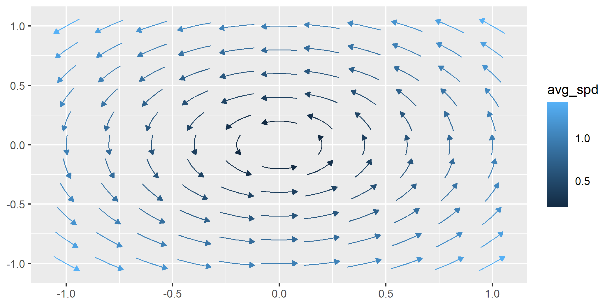
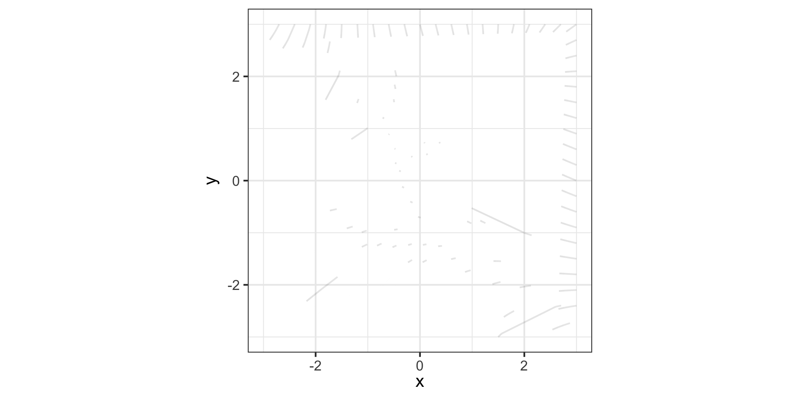

<!-- README.md is generated from README.Rmd. Please edit that file -->

# ggvfields 

## Overview

**ggvfields** provides tools for visualizing vector fields, stream
plots, and soon complex numbers and more.

``` r
remotes::install_github("dusty-turner/ggvfields")
```

``` r
library("ggvfields")
#> Loading required package: ggplot2
options(ggplot2.continuous.colour="viridis")
```

## Usage

### `geom_vector()`: Visualizing Individual Vectors

`geom_vector()` is designed to visualize individual vectors, specified
by either Cartesian (`dx`, `dy`) or polar (`angle`, `distance`)
components. It’s especially useful for directional data like wind
patterns or flow fields.

#### Cartesian Example

``` r
set.seed(1234)
n <- 10
wind_data_polar <- data.frame(
  lon = rnorm(n), 
  lat = rnorm(n), 
  wind_dir = runif(n, -pi, pi),
  wind_spd = rchisq(n, df = 2)
)

wind_data_cartesian <- within(wind_data_polar, {
  wind_lon_comp <- wind_spd * cos(wind_dir)
  wind_lat_comp <- wind_spd * sin(wind_dir)
  dx <- wind_lon_comp
  dy <- wind_lat_comp
})

ggplot(wind_data_cartesian) +
  geom_vector(aes(x = lon, y = lat, dx = dx, dy = dy))
```


#### Polar Example

For polar coordinates, the vector is defined by an angle and distance:

``` r
ggplot(wind_data_cartesian) +
  geom_vector(aes(x = lon, y = lat, angle = wind_dir, distance = wind_spd))
```


### New Feature: Mapping Norm to the Length Aesthetic

One of the innovations of **ggvfields** is the ability to map the
**norm** of vectors directly to their **length** using a length
aesthetic. This feature allows for a more intuitive representation of
vector magnitudes. The length of each vector directly corresponds to its
computed norm - making it easy to compare vector magnitudes visually
within the plot.

Traditionally, vector fields represent direction and magnitude through
arrows of uniform length. This leaves magnitude to be inferred from
color gradients or external legends. With **ggvfields**, the **length**
aesthetic allows users to visually intuit vector magnitude simplifying
their interpretation.

A particularly important aspect of this feature is that the vector
lengths in the plot are **accurately reflected in the legend**. This
allows viewers to match the visual representation of length directly
with the legend’s magnitude scale. This frees up the color aesthetic for
use in visualizing other information about the vector field.

#### Why Use the Length Aesthetic?

- **Clearer Representation**: Vectors with larger norms appear longer,
  making magnitude comparison straightforward.
- **Length-Consistent Legends**: The lengths of vectors in the plot are
  directly tied to the values shown in the legend, ensuring a consistent
  and accurate visual guide.
- **Enhanced Visuals**: Length variations add an extra layer of
  information to the plot, complementing existing aesthetics like color.
- **Flexible Customization**: Combine length mapping with other
  aesthetics such as color gradients or transparency for even richer
  visualizations.

### Example: Mapping Norm to Length

By mapping the norm of a vector to the length aesthetic, users can
directly observe differences in vector magnitude based on the vector’s
actual size.

In this example, the norm of the wind vectors is mapped to their length:

``` r
ggplot(wind_data_cartesian) +
  geom_vector(
    aes(x = lon, y = lat, dx = dx, dy = dy, length = after_stat(norm)),
    arrow = NULL, tail_point = TRUE
  )
#> Note: `normalize = TRUE` does not affect `dx` and `dy` when the `length` aesthetic is mapped.
#> Ensure your `length` values reflect the intended scaling.
```


### `geom_vector_field()`: Visualizing Vector Fields

The `geom_vector_field()` function creates a vector field plot using a
user-defined function to compute vector components. This abstraction
simplifies the mathematical computations involved in vector field
visualizations. Users no longer need to manually calculate vector
components for `geom_segment()`.

Two important options in `geom_vector_field()` are **normalize** and
**center** - both of which default to `TRUE`. These options help control
the visual representation of vectors:

- **normalize**: When set to `TRUE`, this option scales each vector to
  have a unit length, which can help avoid overplotting in dense vector
  fields. This is especially useful when the direction of vectors is
  more important than their magnitude. However, it’s important to note
  that **normalize** is different from mapping the **norm** of the
  vector to the **length** aesthetic. While normalization ensures that
  all vectors are visually uniform in length, mapping the norm to length
  preserves the relative differences in magnitude by varying the vector
  lengths based on their actual norms.

- **center**: By default, **center** is also set to `TRUE`, meaning the
  midpoint of each vector is placed at the corresponding `(x, y)`
  coordinate, effectively “centering” the vector on the point. When
  `center` is `FALSE`, the base of the vector is anchored at the
  `(x, y)` point, and the vector extends outward from there. This is
  useful when the vector field is meant to represent flow starting
  *from* a point, rather than centered around it.

Additionally, **`geom_vector_field()` defaults to
`length = after_stat(norm)`**, which maps the computed vector norms to
the `length` aesthetic. This means that unless specified otherwise, the
vectors’ lengths will automatically be proportional to their calculated
magnitudes.

By using these options, you can control whether vector lengths are
uniform or reflect their actual magnitudes, how the vectors are
positioned relative to their base coordinates, and how the `length`
aesthetic is used in your plot.

#### Example: Basic Vector Field Plot

``` r
f <- function(v) {
  x <- v[1]; y <- v[2]
  c(-y, x) # = f(x,y)
}

ggplot() +
  geom_vector_field(fun = f, xlim = c(-10, 10), ylim = c(-10, 10)) 
#> Note: `normalize = TRUE` does not affect `dx` and `dy` when the `length` aesthetic is mapped.
#> Ensure your `length` values reflect the intended scaling.
```


This function allows the user to map several characteristics of the
vector field to different aesthetic mappings.

### Norm

The norm of a vector $\mathbf{w} = (u, v)$ is given by:

$|\mathbf{w}| = \sqrt{u^2 + v^2}$

We can visualize the norm by mapping it to the length aesthetic:

``` r
ggplot() +
  geom_vector_field(
    fun = f, xlim = c(-10, 10), ylim = c(-10, 10),
    aes(length = after_stat(norm))
  ) 
#> Note: `normalize = TRUE` does not affect `dx` and `dy` when the `length` aesthetic is mapped.
#> Ensure your `length` values reflect the intended scaling.
```


### Divergence

Divergence is an operation on a vector field that describes how the
field behaves at a point—whether vectors “spread out” from a point or
“converge” toward it. Locally, the divergence of a vector field
$\mathbf{F}$ in $\mathbb{R}^2$ at a particular point measures the
“outflowing-ness” or rate of expansion of the vector field around that
point. The divergence is a scalar value that can indicate sources
(positive divergence) or sinks (negative divergence).

If $\mathbf{F} = \langle F_x(x,y), F_y(x,y) \rangle$ is a vector field,
its divergence is defined as:

$$
\text{div} \, \mathbf{F} = \frac{\partial F_x}{\partial x} + \frac{\partial F_y}{\partial y}
$$

To visualize the divergence of the vector field, you can map the
divergence to the color aesthetic.

``` r
ggplot() +
  geom_vector_field(
    aes(length = after_stat(norm), color = after_stat(divergence)), 
    fun = f, xlim = c(-10, 10), ylim = c(-10, 10)
  ) 
#> Note: `normalize = TRUE` does not affect `dx` and `dy` when the `length` aesthetic is mapped.
#> Ensure your `length` values reflect the intended scaling.
```



### Curl

Curl is a measure of the rotation or swirling behavior of a vector field
at a given point. In two dimensions, the curl of a vector field
$\mathbf{F}$ in $\mathbb{R}^2$ is a scalar value that quantifies how
much the vectors tend to rotate or circulate around a point. Positive
curl values indicate counterclockwise rotation, while negative values
represent clockwise rotation.

If $\mathbf{F} = \langle F_x(x,y), F_y(x,y) \rangle$ is a vector field,
its curl is defined as:

$$
\text{curl} \, \mathbf{F} = \frac{\partial F_y}{\partial x} - \frac{\partial F_x}{\partial y}
$$

To visualize the curl of the vector field, you can map the curl to the
color aesthetic.

``` r
ggplot() +
  geom_vector_field(
    aes(color = after_stat(curl)), 
    fun = f, xlim = c(-10, 10), ylim = c(-10, 10)
  ) 
#> Note: `normalize = TRUE` does not affect `dx` and `dy` when the `length` aesthetic is mapped.
#> Ensure your `length` values reflect the intended scaling.
```


### `geom_streamplot()`

The `geom_streamplot()` function generates a stream plot layer of a
user-defined vector field function. The lines in the plot represent the
flow of data points through the vector field.

``` r
f <- function(v) {
  x <- v[1]
  y <- v[2]
  c(-1 - x^2 + y, 1 + x - y^2)
}

ggplot() +
  geom_streamplot(fun = f, xlim = c(-3, 3), ylim = c(-3, 3)) 
```


The `chop` parameter (defaulted to TRUE) allows you to chop the
trajectories into segments. This can be useful for better visualization
of the streamlines when they are long and complex.

It may be useful to not break up the streamlines.

``` r
ggplot() +
  geom_streamplot(fun = f, xlim = c(-3, 3), ylim = c(-3, 3), chop = FALSE) 
```


It may also be useful to break up the streamlines into more segments.
The `scale_stream` parameter (defaults to 1) adjusts the segmentation of
streamlines by specifying the proportion of the streamline length used
to divide it into smaller segments.

``` r
ggplot() +
  geom_streamplot(
    fun = f, xlim = c(-3, 3), ylim = c(-3, 3),
    chop = TRUE, scale_stream = .9,
  ) 
```


### Map Calculus Measures to Aesthetics

``` r
ggplot() +
  geom_streamplot(
    fun = f, xlim = c(-3, 3), ylim = c(-3, 3),
    aes(color = after_stat(log(divergence + abs(min(divergence)))))
  ) +
  labs(color = "adjusted\ndivergence")
```


### Animate `geom_streamplot()`

``` r
# Create stream plot with rownum aesthetic
p <- ggplot() +
 geom_streamplot(
   aes(rownum = after_stat(rownum)), 
    fun = f, xlim = c(-3, 3), ylim = c(-3, 3),
 ) +
 coord_fixed() +
 theme_bw()
# Create an animation transition plot
anim <- animation_transition(plot = p) +   
 gganimate::transition_reveal(rownum) +
 gganimate::ease_aes('linear')

# Animate the plot
gganimate::animate(
  anim, nframes = 25, fps = 5, end_pause = 0, renderer = gganimate::gifski_renderer()
  )
```



### `geom_flow()`

The `geom_flow()` function generates a flow plot layer for a
user-defined vector field function. The lines in the plot represent the
flow of data points through the vector field, visualizing the trajectory
of particles over time. Each flow line traces where a “marble” would
move through the vector field if dropped at a specific starting point,
making this an intuitive way to visualize dynamic systems.

By default, the color of each flow line corresponds to time (`t`),
meaning the color transitions along the path represent the progression
of time. As the flow line evolves, it shows how a particle would move
over time if following the vector field. You can change the coloring by
mapping aesthetics to other computed measures if needed, but time
remains the default.

Flows are computed using the `deSolve` package’s ODE solver, with the
`rk4` method (a fourth-order Runge-Kutta method) used for numerical
integration. This solver ensures accurate and efficient computation of
flow lines, abstracting away complex calculations for the user.

``` r
ggplot() +
  geom_flow(fun = f, xlim = c(-10, 10), ylim = c(-10, 10))
```


In this example, flow lines evolve according to the vector field defined
by `f`. The color along each line will show how the particle moves over
time (`t`) within the vector field.

#### Adaptive Parameters

Several parameters in `geom_flow()` are adaptive, meaning they adjust
automatically based on the characteristics of the vector field and the
plot limits. These adaptive parameters help optimize the flow
visualization without requiring manual tuning:

- **`threshold_distance`**: This parameter controls the minimum distance
  between adjacent flow lines to prevent them from overlapping. If not
  specified, it is calculated automatically as half the Euclidean
  distance between adjacent grid points. This ensures the plot remains
  uncluttered, with flow lines spaced appropriately based on the grid
  dimensions (`n`) and the axis limits (`xlim`, `ylim`).

- **`T`**: This parameter represents the total time span for the ODE
  solver to trace the flow paths. If `T` is `NULL`, it is automatically
  computed by starting from the center of the plot and estimating how
  long it would take a particle to travel from the center to the
  farthest boundary of the vector field - assuming that the vector field
  is not cyclic nor does it reach a sync. This ensures that the
  trajectories capture the significant dynamics of the vector field
  without extending unnecessarily.

- **`iterations`**: This parameter defines the number of time steps for
  the ODE solver to use when tracing the flow lines. A higher number of
  iterations results in smoother and more detailed flows. If
  `iterations` is left as `NULL`, it is computed adaptively based on the
  value of `T`, ensuring that longer time spans result in more
  iterations for smoother paths.

These adaptive parameters allow `geom_flow()` to create a well-balanced
plot by dynamically adjusting the precision and spacing of flow lines,
based on the underlying vector field and plot limits.

#### Example with Custom Parameters

Below is an example where we customize the grid size, time span (`T`),
number of iterations, and the threshold distance between flow lines:

``` r
ggplot() +
  geom_flow(
    fun = f, n = c(21, 21), xlim = c(-10, 10), ylim = c(-10, 10),
    iterations = 1000, threshold_distance = 0.5, T = 5
  ) 
#> Warning in geom_flow(fun = f, n = c(21, 21), xlim = c(-10, 10), ylim = c(-10, :
#> Ignoring unknown parameters: `T`
```


<!-- The `mask_shape_type` parameter allows you to specify the mask shape used for streamline generation which influences how the streamlines are placed and how closely they can approach each other. The default mask shape is `"square"`, but you can also use `"diamond"`, `"inset_square"`, or `"circle"`.  During streamline generation, when a streamline enters the specified shape, no other streamlines will enter that region.  -->
<!-- - **Square Mask (default)**: Streamlines are restricted to a grid where each cell is a square. This generally results in evenly spaced streamlines. -->
<!-- - **Diamond Mask**: Streamlines are restricted to a square grid with diamonds inset within each square.  This can create a more dense pattern which can have better visualizations for some functions. - **Inset Square Mask**: Streamlines are restricted to a grid with smaller squares inset within larger squares. This can create a denser and more detailed pattern of streamlines. -->
<!-- - **Diamond Mask**: Streamlines are restricted to a square grid with diamonds inset within each square.  This can create a more dense pattern which can have better visualizations for some functions. - **Circle Mask**: Streamlines are restricted to a grid with inset circles inside the square grid. -->
<!-- ```{r} -->
<!-- ggplot() + -->
<!--   geom_streamplot(aes(group = after_stat(id)), -->
<!--                   fun = f, xlim = c(-3, 3), ylim = c(-3, 3), max_length = 10000, -->
<!--                   max_steps = 10000, ds = .05, min_dist = .25,  -->
<!--                   mask_shape_type = "diamond") + -->
<!--   coord_fixed() + -->
<!--   theme_minimal() -->
<!-- ``` -->
<!-- ### `geom_complex_function()`{.R} -->
<!-- The `geom_complex_function()`{.R} function generates a vector field plot layer using a user-defined function to compute the vector components. This function abstracts away the mathematical computations required to generate the vector field, so the user does not need to manually calculate and input the vector components into `geom_segment()`{.R}. It simplifies the process, making it easier to create vector field visualizations without dealing with the underlying math. -->
<!-- ```{r} -->
<!-- f <- function(z) (z^2 + 1) / (z^2 - 1) -->
<!-- ggplot() + -->
<!--   geom_complex_function(fun = f, relim = c(-2, 2), imlim = c(-2, 2), n = 100) + -->
<!--   labs(x = "Real", y = "Imaginary") + -->
<!--   coord_fixed() + -->
<!--   theme(legend.box = "horizontal") -->
<!-- ``` -->
<!-- We can enhance this plot with a little help from biscale. -->
<!-- Using biscale, we can apply a bivariate color scale to the plot, which allows us to represent two variables—angle (direction) and magnitude (intensity)—simultaneously. This makes it easier to visualize how these properties change across the field. -->
<!-- ```{r} -->
<!-- library(biscale) -->
<!-- library(cowplot) -->
<!-- plot <- -->
<!--   ggplot() + -->
<!--   geom_complex_function(aes(fill = after_stat(bi_class)), -->
<!--     fun = f, relim = c(-2, 2), imlim = c(-2, 2), n = 100 -->
<!--     ) + -->
<!--     bi_scale_fill(pal = "DkBlue") + -->
<!--     labs( -->
<!--       title = "", -->
<!--       x = "Real (Re)", -->
<!--       y = "Imaginary (Im)" -->
<!--     ) + -->
<!--     bi_theme(base_size = 16) + -->
<!--     theme(legend.position = "none") + -->
<!--   coord_fixed()  -->
<!-- legend <- bi_legend(pal = "DkBlue", -->
<!--                     xlab = "Angle", -->
<!--                     ylab = "Magnitude", -->
<!--                     size = 6) -->
<!-- ggdraw() + -->
<!--   draw_plot(plot, 0, 0, .8, 1) +   -->
<!--   draw_plot(legend, x = .55, y = .6, width = .3, height = 0.3) -->
<!-- ``` -->

## In Development

### `geom_vector_smooth()`

The `geom_vector_smooth()` function is designed to provide a smoothed
estimate of a vector field based on observed vector components. Just as
`geom_smooth()` fits a regression line through data points,
`geom_vector_smooth()` fits a smooth vector field through individual
vector observations. It does this by applying statistical smoothing
techniques to the vector components (`dx`, `dy`) to create a smooth
representation of the direction and magnitude transitions across the
field.

#### Example Usage

``` r
# Create a function to generate random vectors based on (x, y) inputs
generate_vectors <- function(v) {
  x <- v[1]
  y <- v[2]
  c(-1 - x^2 + y, 1 + x - y^2)  
}

# Set seed for reproducibility
set.seed(123)

# Generate sample points for the vector field
sample_points <- data.frame(
  x = runif(50, min = -10, max = 10),  
  y = runif(50, min = -10, max = 10)   
)

# Apply the generate_vectors function to each row to create displacements
result <- t(apply(sample_points, 1, generate_vectors))

# Create new columns for the end coordinates (xend, yend)
sample_points$xend <- result[, 1]
sample_points$yend <- result[, 2]

# Calculate the displacements (dx, dy)
sample_points$dx <- sample_points$xend - sample_points$x
sample_points$dy <- sample_points$yend - sample_points$y

# Visualize the original and smoothed vectors using `ggplot2` from ggvfields
ggplot(sample_points, aes(x = x, y = y)) +
  geom_vector(aes(dx = dx, dy = dy)) +  
  geom_vector_smooth(aes(dx = dx, dy = dy), n = 6, center = FALSE, probs = c(.95, .7)) + 
  coord_equal()
```


This example demonstrates how `geom_vector_smooth()` can be used to fit
a vector field to vector data.

## License

This package is licensed under the MIT License.

## Contact

For any questions or issues, please [open an
issue](https://github.com/dusty-turner/ggvfields/issues/new) on GitHub
or contact the maintainer.

## Related projects

For creating vector fields, the
[**ggquiver**](http://pkg.mitchelloharawild.com/ggquiver/) package
provides quiver plots to visualize vector fields, while the
[**ggarchery**](https://github.com/mdhall272/ggarchery) package can
handling of segments with arrowheads.
