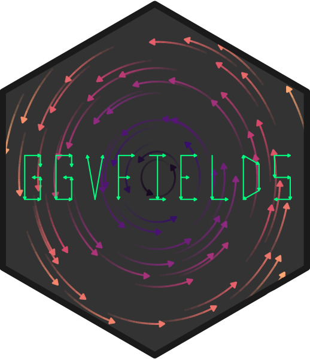
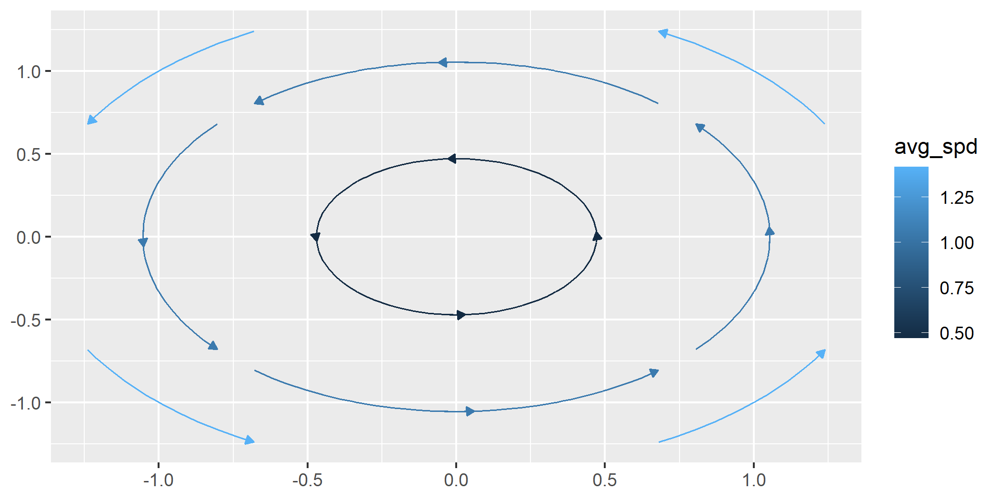
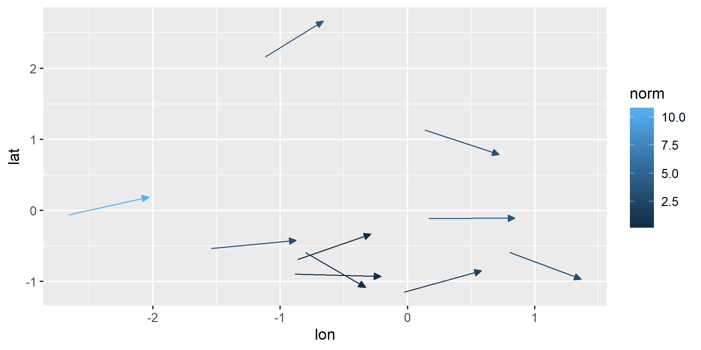

<!-- README.md is generated from README.Rmd. Please edit that file -->

# ggvfields 

[](https://www.repostatus.org/#active)
[](https://github.com/dusty-turner/ggvfields)
[](https://app.codecov.io/gh/dusty-turner/ggvfields)

<!-- badger::badge_cran_download() -->
<!-- badger::badge_doi() -->

**ggvfields** is a powerful package for visualizing vector fields,
stream plots, and related visualizations. It provides tools to explore
directional data, including options for vector smoothing, gradient
fields, potential visualizations, and dynamic flow representations.

## Installation

Install **ggvfields** directly from GitHub:

``` r
remotes::install_github("dusty-turner/ggvfields")
```

Load the package in R:

``` r
library("ggvfields")
#> Loading required package: ggplot2
options(ggplot2.continuous.colour="viridis")
```

Generate sample wind data:

``` r
set.seed(1234)
n <- 10

wind_data <- data.frame(
  lon = rnorm(n), 
  lat = rnorm(n), 
  dir = runif(n, -pi/4, pi/4),
  spd = rchisq(n, df = 2)
) |> 
  within({
    fx    <- spd * cos(dir)          # Compute the x-component of the vector
    fy    <- spd * sin(dir)          # Compute the y-component of the vector
    xend  <- lon + fx                # Compute the end x-coordinate
    yend  <- lat + fy                # Compute the end y-coordinate
  })

round(wind_data, digits = 2) 
#>      lon   lat   dir   spd  yend  xend    fy    fx
#> 1  -1.21 -0.48  0.08  3.55 -0.18  2.33  0.30  3.53
#> 2   0.28 -1.00  0.23  2.19 -0.50  2.41  0.50  2.13
#> 3   1.08 -0.78 -0.30  2.99 -1.65  3.94 -0.87  2.86
#> 4  -2.35  0.06  0.19 10.81  2.12  8.26  2.06 10.61
#> 5   0.43  0.96 -0.27  3.45  0.05  3.75 -0.91  3.33
#> 6   0.51 -0.11  0.00  3.91 -0.10  4.41  0.01  3.91
#> 7  -0.57 -0.51  0.28  0.16 -0.47 -0.42  0.04  0.15
#> 8  -0.55 -0.91 -0.02  0.42 -0.92 -0.12 -0.01  0.42
#> 9  -0.56 -0.84 -0.40  0.42 -1.00 -0.18 -0.16  0.38
#> 10 -0.89  2.42  0.42  4.17  4.11  2.92  1.69  3.81
```

------------------------------------------------------------------------

## Core Features

### `geom_vector` and `geom_vector2`

These functions allow for flexible visualizations of vector data.

- **`geom_vector`**: By default, this maps the norm (magnitude) of a
  vector to its color. This helps compare relative magnitudes visually
  through color gradients. Users do not need to explicitly specify this
  unless overriding the default behavior.

``` r
ggplot(wind_data) +
  geom_vector(aes(x = lon, y = lat, xend = xend, yend = yend)) 
```


`geom_vector` also supports both `xend`/`yend` format as well as
`fx`/`fy` format.

``` r
ggplot(wind_data) +
  geom_vector(aes(x = lon, y = lat, fx = fx, fy = fy)) 
```


- **`geom_vector2`**: Maps the norm of a vector directly to its length.
  This provides a more intuitive representation of magnitude. This is
  done by mapping `length = after_stat(norm)` by default.

``` r
ggplot(wind_data) +
  geom_vector2(aes(x = lon, y = lat, fx = fx, fy = fy)) 
```


#### Why Length Mapping Matters

Mapping vector lengths to their norms allows viewers to immediately
understand magnitude differences without relying solely on color.

The norm $\mathbf{w} = (u, v)$ is calculated
$$|\mathbf{w}| = \sqrt{u^2 + v^2}$$ .

This feature of `geom_vector2` enhances interpretability by using actual
vector lengths to represent magnitude. The legend reflects the scaling
and ensures consistent interpretation.

#### Polar Coordinates Support

Both `geom_vector` and `geom_vector2` also support polar coordinates,
where vectors are specified using magnitude (`distance`) and direction
(`angle`). Instead of providing Cartesian components (`fx`, `fy` or
`xend`, `yend`), users can directly supply polar data. This feature
simplifies workflows for directional data and works for all subsequent
relevant functions that handle polar coordinates.

Polar coordinates can be visualized like this:

``` r
ggplot(wind_data) +
  geom_vector(aes(x = lon, y = lat, distance = spd, angle = dir)) 
```


#### Normalize and Center

Two important options in `geom_vector` and subsequent functions are
`normalize` and `center` - both of which default to `TRUE.` These
options help control the visual representation of vectors:

- `normalize`: When set to `TRUE`, this option scales each vector to
  have a unit length, which can help avoid overplotting in dense vector
  fields. This is especially useful when the direction of vectors is
  more important than their magnitude. However, it’s important to note
  that normalize is different from mapping the norm of the vector to the
  length aesthetic. While normalization ensures that all vectors are
  visually uniform in length, mapping the norm to length preserves the
  relative differences in magnitude by varying the vector lengths based
  on their actual norms.

- `center`: By default, `center` is also set to `TRUE`, meaning the
  midpoint of each vector is placed at the corresponding (`x`, `y`)
  coordinate, effectively “centering” the vector on the point. When
  center is `FALSE`, the base of the vector is anchored at the (`x`,
  `y`) point, and the vector extends outward from there.

The example below turns off this default behavior:

``` r
ggplot(wind_data) +
  geom_vector(aes(x = lon, y = lat, fx = fx, fy = fy), center = FALSE, normalize = FALSE) 
```


### `geom_vector_field` and `geom_vector_field2`

- **`geom_vector_field`**: Computes vector fields from a user-defined
  function and maps the norm to color.

``` r
f <- function(v) c(-v[2], v[1]) # Define a function for the vector field

ggplot() +
  geom_vector_field(fun = f) 
```


- **`geom_vector_field2`**: Similar to `geom_vector_field`, but maps the
  norm of vectors to their lengths instead of color.

``` r
ggplot() +
  geom_vector_field2(fun = f) 
```



#### Automatic Limit Detection

Both `geom_vector_field` and `geom_vector_field2` can automatically
determine plot limits based on the function provided. This happens when
data exists in previous layers or in the base ggplot object. This allows
the limits to be inferred from context. Customize limits with the `xlim`
and `ylim` parameters if needed for more control.

``` r
ggplot(data = wind_data, aes(x = lon, y = lat, fx = fx, fy = fy)) +
  geom_vector() +
  geom_vector_field(fun = f) # Automatically determines limits based on existing data
```


------------------------------------------------------------------------

## Advanced Features

This section introduces tools for deeper exploration of vector fields,
allowing users to analyze properties such as smoothness, uncertainty,
gradients, and potential functions. These tools provide mathematical
insights into the structure of vector fields and extend visualization
capabilities beyond basic representations.

Key capabilities include:

- **Smoothing Vector Fields**: Approximate trends in noisy vector data
  and compute prediction intervals for uncertainty visualization.  
- **Gradient and Potential Analysis**: Derive gradient fields to study
  scalar variations and visualize potential functions to identify
  conservative fields.  
- **Dynamic Flow and Stream Plots**: Model particle trajectories and
  visualize dynamic behavior in time-dependent fields.  
- **Mathematical Feature Mapping**: Display vector norms, divergence,
  and curl to highlight flow strength, expansion, and rotational
  behavior.

### `geom_vector_smooth`

Provides smoothed estimates of vector fields by applying statistical
techniques to observed vectors.

Smoothing is performed using a multivariate linear model defined by:

$$
\begin{pmatrix}
\hat{dx} \\
\hat{dy}
\end{pmatrix} = \beta_0 + \beta_1 x + \beta_2 y + \beta_3 xy
$$

where $\beta$ are coefficients estimated by ordinary least squares
(OLS). This approach captures linear and interaction effects to
approximate the underlying vector field. This function also creates a
prediction interval around the vector specified by the `conf_level`
argument and defaults to `.95`.

- **Evaluating Specific Points**:

When evaluation points are provided, smoothing is performed at those
locations and prediction intervals can be visualized using either wedges
or ellipses to indicate uncertainty.

``` r
eval_point <- data.frame(x = .5, y = .5) 

ggplot(wind_data, aes(x = lon, y = lat, fx = fx, fy = fy)) +
  geom_vector(aes(color = after_stat(NULL)), normalize = FALSE) +
  geom_vector_smooth(eval_points = eval_point) +
  lims(x = c(-7,10), y = c(-3,3))
#> Warning: Removed 2 rows containing missing values or values outside the scale range
#> (`geom_stream()`).
```


- **Using Wedges to Visualize Uncertainty**:

``` r
ggplot(wind_data, aes(x = lon, y = lat, fx = fx, fy = fy)) +
  geom_vector(aes(color = after_stat(NULL)), normalize = FALSE) +
  geom_vector_smooth(eval_points = eval_point, pi_type = "wedge") 
```


- **Grid-Based Smoothing**:

``` r
ggplot(wind_data, aes(x = lon, y = lat, fx = fx, fy = fy)) +
  geom_vector_smooth(pi_type = "wedge") + 
  geom_vector() 
```


- **Custom Grid Resolution**:

``` r
ggplot(wind_data, aes(x = lon, y = lat, fx = fx, fy = fy)) +
  geom_vector_smooth(n = 6, pi_type = "wedge") 
```


- **Altering Confidence Level**

For all options, you can change the confidence level from the default to
another value by using the `conf_level` argument.

``` r
ggplot(wind_data, aes(x = lon, y = lat, fx = fx, fy = fy)) +
  geom_vector(aes(color = after_stat(NULL)), normalize = FALSE) +
  geom_vector_smooth(eval_points = eval_point, pi_type = "wedge") +
  geom_vector_smooth(eval_points = eval_point, pi_type = "wedge", conf_level = .7) 
```


### `geom_gradient_field` and `geom_gradient_field2`

The geom_gradient_field function computes and visualizes gradient fields
derived from scalar functions and displays the gradient vector field of
a scalar function, $f(x, y)$. The gradient is given by:

$$
\nabla f(x, y) = \left( \frac{\partial f}{\partial x}, \frac{\partial f}{\partial y} \right)
$$

This vector field points in the direction of the greatest rate of
increase of the scalar function. The function numerically evaluates
these partial derivatives and visualizes the resulting vectors.

- **Gradient Field with Norm to Color**:

``` r
paraboloid_field <- function(v) {
  x <- v[1]
  y <- v[2]
  x^2 + y^2
}

ggplot() +
  geom_gradient_field(fun = paraboloid_field, xlim = c(-10, 10), ylim = c(-10, 10))
```


- **Gradient Field with Norm to Length**:

``` r
ggplot() +
  geom_gradient_field2(fun = paraboloid_field, xlim = c(-10, 10), ylim = c(-10, 10))
```


- **Adjusting Grid Density**:

The `n` parameter adjusts the density of the grid used to evaluate the
gradient field. Decreasing `n` reduces the number of vectors which
producing a coarser grid while increasing `n` results in a finer grid
with more vectors.

``` r
ggplot() +
  geom_gradient_field(fun = paraboloid_field, xlim = c(-10, 10), ylim = c(-10, 10), n = 5)
```



### `geom_potential`

A potential function represents a scalar field whose gradient produces a
vector field. It is used to describe conservative vector fields which
exist when the curl of the vector field is 0.

The `geom_potential` function computes and visualizes the scalar
potential function for a given conservative vector field. The input
function must represent a 2D vector field and the output is the
corresponding potential function. If the input field is not
conservative, the function checks this condition numerically based on a
tolerance parameter. The tolerance determines how strictly the field
must satisfy the conservation condition.

``` r
conservative_fun <- function(v) {
 x <- v[1]
 y <- v[2]
 c(sin(x) + y, x - sin(y))
}

ggplot() +
  geom_potential(fun = conservative_fun, xlim = c(-2*pi, 2*pi), ylim = c(-2*pi, 2*pi))
#> Warning in geom_potential(fun = conservative_fun, xlim = c(-2 * pi, 2 * :
#> Ignoring unknown parameters: `lineend`, `linejoin`, and `linemitre`
```


The tolerance parameter can be adjusted to control the sensitivity of
the conservativeness check. Decreasing the tolerance makes the check
stricter, while increasing it allows for more numerical error.

``` r
ggplot() +
  geom_potential(fun = conservative_fun, xlim = c(-2*pi, 2*pi), ylim = c(-2*pi, 2*pi), tolerance = 1e-4)
#> Warning in geom_potential(fun = conservative_fun, xlim = c(-2 * pi, 2 * : Ignoring unknown parameters: `lineend`, `linejoin`, `linemitre`, and
#> `tolerance`
```


As with other functions, we can increase the granulatity of the
visualization with the `n` parameter.

``` r
ggplot() +
  geom_potential(fun = conservative_fun, xlim = c(-2*pi, 2*pi), ylim = c(-2*pi, 2*pi), n = 50)
#> Warning in geom_potential(fun = conservative_fun, xlim = c(-2 * pi, 2 * :
#> Ignoring unknown parameters: `lineend`, `linejoin`, and `linemitre`
```


## License

This package is licensed under the MIT License.

## Contact

For questions or feedback, please [open an
issue](https://github.com/dusty-turner/ggvfields/issues/new).

## Related Projects

- [ggquiver](http://pkg.mitchelloharawild.com/ggquiver/): Quiver plots
  for vector fields.
- [ggarchery](https://github.com/mdhall272/ggarchery): Arrow segment
  visualizations.
