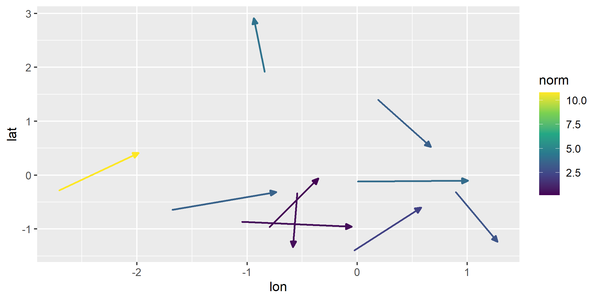
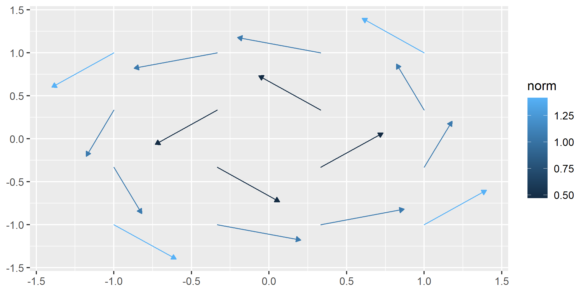

<!-- README.md is generated from README.Rmd. Please edit that file -->

# **ggvfields**

## Overview

**ggvfields** provides tools for visualizing vector fields, complex
numbers, and soon dual numbers and more.

``` r
library("ggvfields")
#> Loading required package: ggplot2
```

## Usage

### `geom_vector_field()`

The `geom_vector_field()` function generates a vector field plot layer
using a user-defined function to compute the vector components. This
function abstracts away the mathematical computations required to
generate the vector field, so the user does not need to manually
calculate and input the vector components into `geom_segment()`. It
simplifies the process, making it easier to create vector field
visualizations without dealing with the underlying math.

``` r
# custom function
f <- function(v) {
  x <- v[1]; y <- v[2]
  c(-y, x) # = f(x,y)
}

# create a ggplot with the vector field layer
ggplot() +
  geom_vector_field(fun = f, xlim = c(-10, 10), ylim = c(-10, 10)) +
  coord_fixed()
```



This function also offers several aesthetic mappings which allow you to
map several characteristics of the vector field to different aesthetic
mappings.

#### Vector Magnitude

The magnitude (or length) of a vector $\mathbf{w} = (u, v)$ is given by:

$|\mathbf{w}| = \sqrt{u^2 + v^2}$

To visualize the magnitude of the vectors:

``` r
ggplot() +
  geom_vector_field(
    aes(color = after_stat(magnitude)),
    fun = f, xlim = c(-10, 10), ylim = c(-10, 10),
  ) +
  coord_fixed()
```


#### Divergence

The divergence of a vector field $\mathbf{F} = (F_x, F_y)$ is given by:

$\nabla \cdot \mathbf{F} = \frac{\partial F_x}{\partial x} + \frac{\partial F_y}{\partial y}$

To visualize the divergence of the vector field:

``` r
ggplot() +
  geom_vector_field(
    aes(color = after_stat(divergence)), 
    fun = f, xlim = c(-10, 10), ylim = c(-10, 10)
  ) +
  coord_fixed()
```


#### Laplace Operator

For a vector field $\mathbf{F} = (F_x, F_y)$, the Laplacian is given by:

$\Delta \mathbf{F} = \left( \frac{\partial^2 F_x}{\partial x^2} + \frac{\partial^2 F_x}{\partial y^2}, \frac{\partial^2 F_y}{\partial x^2} + \frac{\partial^2 F_y}{\partial y^2} \right)$

To visualize the Laplace operator of the vector field:

``` r
ggplot() +
  geom_vector_field(
    aes(color = after_stat(curl)), 
    fun = f, xlim = c(-10, 10), ylim = c(-10, 10)
  ) +
  coord_fixed()
```


#### Directional Derivative

The directional derivative of a vector field $\mathbf{F} = (F_x, F_y)$
in the direction of a vector $\mathbf{v} = (v_x, v_y)$ is given by:

$D_{\mathbf{v}} \mathbf{F} = \left( \frac{\partial F_x}{\partial x} v_x + \frac{\partial F_x}{\partial y} v_y, \frac{\partial F_y}{\partial x} v_x + \frac{\partial F_y}{\partial y} v_y \right)$

For a vector field, it is the rate of change of the field in the given
direction.

To visualize the directional derivative from any point to another point
`c(u, v)` within the vector field:

``` r
x1 <- 5
y1 <- 6

ggplot() +
  geom_vector_field(
    aes(color = after_stat(directional_derivative)),
    fun = f, xlim = c(-10, 10), ylim = c(-10, 10),
    u = x1, v = y1) +
  geom_point(aes(x = x1, y = y1)) +
  scale_color_viridis_c() +
  coord_fixed()
```



### `geom_complex_function()`

The `geom_complex_function()` function generates a vector field plot
layer using a user-defined function to compute the vector components.
This function abstracts away the mathematical computations required to
generate the vector field, so the user does not need to manually
calculate and input the vector components into `geom_segment()`. It
simplifies the process, making it easier to create vector field
visualizations without dealing with the underlying math.

``` r
# custom function
f <- function(z) (z^2 + 1) / (z^2 - 1)

# create a ggplot with the complex vector field layer
ggplot() +
  geom_complex_function(fun = f, relim = c(-2, 2), imlim = c(-2, 2), n = 100) +
  coord_fixed()
```


## License

This package is licensed under the MIT License.

## Contact

For any questions or issues, please [open an
issue](https://github.com/dusty-turner/ggvfields/issues/new) on GitHub
or contact the maintainer.

## Installation

You can install the development version from GitHub:

``` r
devtools::install_github("dusty-turner/ggvfields")
```
