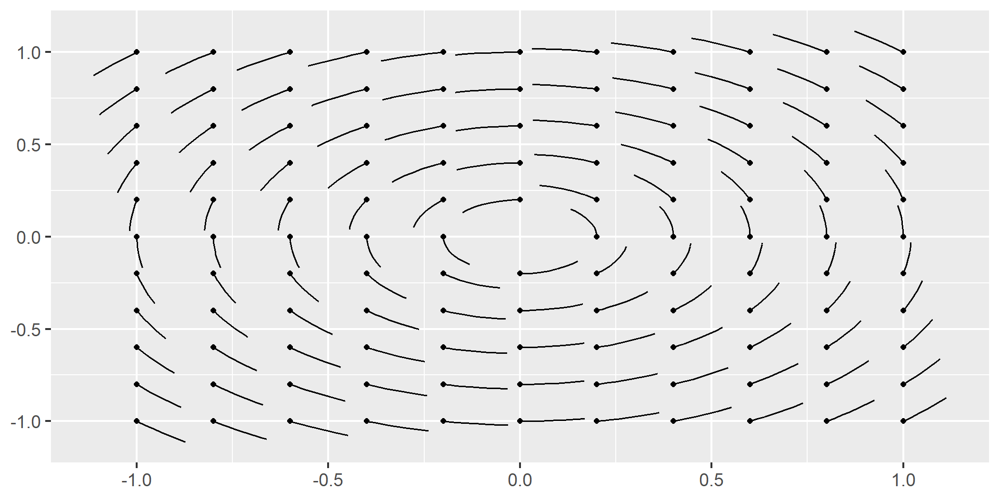
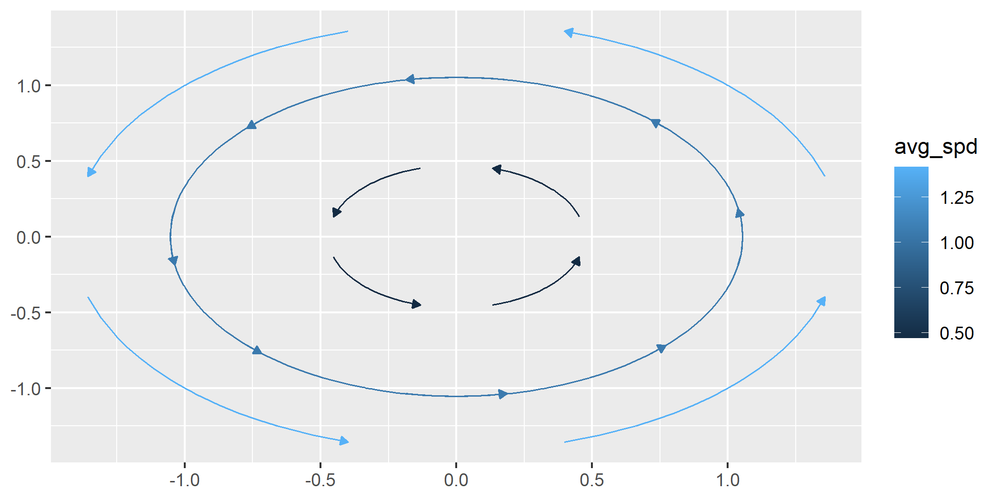

<!-- README.md is generated from README.Rmd. Please edit that file -->

# **ggvfields**

## Overview

**ggvfields** provides tools for visualizing vector fields, stream
plots, and soon complex numbers and more.

``` r
remotes::install_github("dusty-turner/ggvfields")
```

``` r
library("ggvfields")
#> Loading required package: ggplot2
options(ggplot2.continuous.colour="viridis")
```

## Usage

### `geom_vector_field()`

The `geom_vector_field()` function generates a vector field plot layer
using a user-defined function to compute the vector components. This
function abstracts away the mathematical computations required to
generate the vector field, so the user does not need to manually
calculate and input the vector components into `geom_segment()`. It
simplifies the process, making it easier to create vector field
visualizations without dealing with the underlying math.

``` r
f <- function(v) {
  x <- v[1]; y <- v[2]
  c(-y, x) # = f(x,y)
}

ggplot() +
  geom_vector_field(fun = f, xlim = c(-10, 10), ylim = c(-10, 10)) +
  coord_fixed() 
```


This function allows the user to map several characteristics of the
vector field to different aesthetic mappings.

#### Norm

The norm of a vector $\mathbf{w} = (u, v)$ is given by:

$|\mathbf{w}| = \sqrt{u^2 + v^2}$

We can visualize the norm by mapping the value of the norm to the color
aesthetic.

``` r
ggplot() +
  geom_vector_field(
    aes(color = after_stat(norm)),
    fun = f, xlim = c(-10, 10), ylim = c(-10, 10)) +
  coord_fixed()
```


#### Divergence

Divergence is an operation on a vector field that tells us how the field
behaves toward or away from a point. Locally, the divergence of a vector
field $\mathbf{F}$ in $\mathbb{R}^2$ at a particular point is a measure
of the “outflowing-ness” of the vector field at that particular point.
The divergence of a vector field results in a scalar function.

If $\mathbf{F} = \langle \mathbf{F}_x(x,y), \mathbf{F}_y(x,y) \rangle$
is a vector field in $\mathbb{R}^2$, then the divergence of $\mathbf{F}$
is defined by:

$$
\text{div} \, \mathbf{F} = \frac{\partial \mathbf{F}_x}{\partial x} + \frac{\partial \mathbf{F}_y}{\partial y}
$$

To visualize the divergence of the vector field:

``` r
ggplot() +
  geom_vector_field(
    aes(color = after_stat(divergence)), 
    fun = f, xlim = c(-10, 10), ylim = c(-10, 10)
  ) +
  coord_fixed()
```


#### Curl

Curl is an operation on a vector field that measures the rotation or
swirling strength at a point. In two dimensions, the curl of a vector
field $\mathbf{F}$ in $\mathbb{R}^2$ is a scalar value that indicates
how much the vector field tends to rotate around that point.

If $\mathbf{F} = \langle \mathbf{F}_x(x,y), \mathbf{F}_y(x,y) \rangle$
is a vector field in $\mathbb{R}^2$, then the curl of $\mathbf{F}$ is
defined by:

$$
\text{curl} \, \mathbf{F} = \frac{\partial \mathbf{F}_y}{\partial x} - \frac{\partial \mathbf{F}_x}{\partial y}
$$

To visualize the the curl:

``` r
ggplot() +
  geom_vector_field(
    aes(color = after_stat(curl)), 
    fun = f, xlim = c(-10, 10), ylim = c(-10, 10)
  ) +
  coord_fixed()
```


#### Laplace Operator

The Laplace operator (or Laplacian) measures the rate at which the
average value of a function around a point differs from the value at
that point. It is commonly used to understand how a scalar field spreads
out or compresses in space.

If $\mathbf{F} = \langle \mathbf{F}_x(x,y), \mathbf{F}_y(x,y) \rangle$
is a vector field in $\mathbb{R}^2$, then the Laplacian of $\mathbf{F}$
is defined by taking the sum of the second partial derivatives of each
component of the vector field.

The Laplacian of the vector field $\mathbf{F}$ is thus given by:

$$
\Delta \mathbf{F} = \frac{\partial^2 \mathbf{F}_x}{\partial x^2} + \frac{\partial^2 \mathbf{F}_x}{\partial y^2} + \frac{\partial^2 \mathbf{F}_y}{\partial x^2} + \frac{\partial^2 \mathbf{F}_y}{\partial y^2}
$$

This results in a scalar value that describes how the vector field
spreads out or compresses at different points in the field.

To visualize the Laplace operator of the vector field, lets look at a
different vector field:

``` r
g <- function(v) {
  x <- v[1]
  y <- v[2]
  c(-sin(y), cos(x))
}

ggplot() +
  geom_vector_field(
    aes(color = after_stat(laplacian)), 
    n = 15, 
    fun = g, xlim = c(-2*pi, 2*pi), ylim = c(-2*pi, 2*pi)
  ) +
  coord_fixed() 
```


#### Directional Derivative

The directional derivative of a vector field measures the rate of change
of the field in a specified direction. It provides insight into how the
field varies as you move in a particular direction.

If $\mathbf{F} = \langle \mathbf{F}_x(x,y), \mathbf{F}_y(x,y) \rangle$
is a vector field in $\mathbb{R}^2$, and
$\mathbf{v} = \langle v_x, v_y \rangle$ is a direction vector, then the
directional derivative of $\mathbf{F}$ in the direction of $\mathbf{v}$
is given by:

$$
D_{\mathbf{v}} \mathbf{F} = \frac{\partial \mathbf{F}_x}{\partial x} v_x + \frac{\partial \mathbf{F}_x}{\partial y} v_y + \frac{\partial \mathbf{F}_y}{\partial x} v_x + \frac{\partial \mathbf{F}_y}{\partial y} v_y
$$

For a vector field, this represents the rate of change of each component
of the field in the direction specified by $\mathbf{v}$.

To visualize the Laplace operator of the vector field:

``` r
vec <- c(5, 6)

ggplot() +
  geom_vector_field(
    aes(color = after_stat(directional_derivative)),
    fun = f, xlim = c(-10, 10), ylim = c(-10, 10),
    v = vec) +
  geom_point(aes(x = vec[1], y = vec[2])) +
  coord_fixed() 
```


#### Aesthetics In Development

Another aesthetic in development available for mapping is length. The
length aesthetic maps the value of the computed measure to the length of
the vector.

``` r
ggplot() +
  geom_vector_field(
    aes(length = after_stat(norm), color = after_stat(norm)),
    fun = f, xlim = c(-10, 10), ylim = c(-10, 10)) +
  coord_fixed() +
  theme(legend.box = "horizontal")
```



### `geom_streamplot()`

The `geom_streamplot()` function generates a stream plot layer of a
user-defined vector field function. The lines in the plot represent the
flow of data points through the vector field.

``` r
f <- function(v) {
  x <- v[1]
  y <- v[2]
  c(-1 - x^2 + y, 1 + x - y^2)
}

ggplot() +
  geom_streamplot(
    fun = f, xlim = c(-3, 3), ylim = c(-3, 3), 
    ) +
  coord_fixed() +
  theme_minimal()
```


The `chop` parameter (defaulted to TRUE) allows you to chop the
trajectories into segments. This can be useful for better visualization
of the streamlines when they are long and complex.

It may be useful to not break up the streamlines.

``` r
ggplot() +
  geom_streamplot(
    fun = f, xlim = c(-3, 3), ylim = c(-3, 3), 
    chop = FALSE
    ) +
  coord_fixed() +
  theme_minimal()
```


It may also be useful to break up the streamlines into more segments.
The `scale_stream` parameter (defaults to 1) adjusts the segmentation of
streamlines by specifying the proportion of the streamline length used
to divide it into smaller segments.

``` r
ggplot() +
  geom_streamplot(
    fun = f, xlim = c(-3, 3), ylim = c(-3, 3), 
    chop = TRUE, scale_stream = .9,
    ) +
  coord_fixed() +
  theme_minimal()
```


The `mask_shape_type` parameter allows you to specify the mask shape
used for streamline generation which influences how the streamlines are
placed and how closely they can approach each other. The default mask
shape is `"square"`, but you can also use `"diamond"`, `"inset_square"`,
or `"circle"`. During streamline generation, when a streamline enters
the specified shape, no other streamlines will enter that region.

- **Square Mask (default)**: Streamlines are restricted to a grid where
  each cell is a square. This generally results in evenly spaced
  streamlines.
- **Diamond Mask**: Streamlines are restricted to a square grid with
  diamonds inset within each square. This can create a more dense
  pattern which can have better visualizations for some functions. -
  **Inset Square Mask**: Streamlines are restricted to a grid with
  smaller squares inset within larger squares. This can create a denser
  and more detailed pattern of streamlines.
- **Diamond Mask**: Streamlines are restricted to a square grid with
  diamonds inset within each square. This can create a more dense
  pattern which can have better visualizations for some functions. -
  **Circle Mask**: Streamlines are restricted to a grid with inset
  circles inside the square grid.

``` r
ggplot() +
  geom_streamplot(aes(group = after_stat(id)),
                  fun = f, xlim = c(-3, 3), ylim = c(-3, 3), max_length = 10000,
                  max_steps = 10000, ds = .05, min_dist = .25, 
                  mask_shape_type = "diamond") +
  coord_fixed() +
  theme_minimal()
#> Warning in geom_streamplot(aes(group = after_stat(id)), fun = f, xlim = c(-3, :
#> Ignoring unknown parameters: `max_length`, `max_steps`, and `min_dist`
```



### `geom_complex_function()`

The `geom_complex_function()` function generates a vector field plot
layer using a user-defined function to compute the vector components.
This function abstracts away the mathematical computations required to
generate the vector field, so the user does not need to manually
calculate and input the vector components into `geom_segment()`. It
simplifies the process, making it easier to create vector field
visualizations without dealing with the underlying math.

``` r
f <- function(z) (z^2 + 1) / (z^2 - 1)

ggplot() +
  geom_complex_function(fun = f, relim = c(-2, 2), imlim = c(-2, 2), n = 100) +
  labs(x = "Real", y = "Imaginary") +
  coord_fixed() +
  theme(legend.box = "horizontal")
```


We can enhance this plot with a little help from biscale.

Using biscale, we can apply a bivariate color scale to the plot, which
allows us to represent two variables—angle (direction) and magnitude
(intensity)—simultaneously. This makes it easier to visualize how these
properties change across the field.

``` r
library(biscale)
library(cowplot)

plot <-
  ggplot() +
  geom_complex_function(aes(fill = after_stat(bi_class)),
    fun = f, relim = c(-2, 2), imlim = c(-2, 2), n = 100
    ) +
    bi_scale_fill(pal = "DkBlue") +
    labs(
      title = "",
      x = "Real (Re)",
      y = "Imaginary (Im)"
    ) +
    bi_theme(base_size = 16) +
    theme(legend.position = "none") +
  coord_fixed() 
  
legend <- bi_legend(pal = "DkBlue",
                    xlab = "Angle",
                    ylab = "Magnitude",
                    size = 6)

ggdraw() +
  draw_plot(plot, 0, 0, .8, 1) +  
  draw_plot(legend, x = .55, y = .6, width = .3, height = 0.3)
```


## License

This package is licensed under the MIT License.

## Contact

For any questions or issues, please [open an
issue](https://github.com/dusty-turner/ggvfields/issues/new) on GitHub
or contact the maintainer.

## Installation

You can install the development version from GitHub:

``` r
devtools::install_github("dusty-turner/ggvfields")
```

## Related projects

For creating vector fields, the
[**ggquiver**](http://pkg.mitchelloharawild.com/ggquiver/) package
provides quiver plots to visualize vector fields, while the
[**ggarchery**](https://github.com/mdhall272/ggarchery) package can
handling of segments with arrowheads.
