# The Art of Flow: A Visual Gallery

``` r
library(ggvfields)
library(ggplot2)
```

Vector fields are everywhere – in the curl of ocean currents, the pull
of gravity, the arc of a magnetic dipole, and the swirl of a galaxy.
**ggvfields** brings these invisible forces to life inside the familiar
grammar of ggplot2.

This vignette is not a tutorial. It is a gallery – a collection of
visualizations designed to spark your imagination and show what is
possible when mathematics meets aesthetics.

------------------------------------------------------------------------

## I. Whirlpool

A pure rotational field, but with a radial decay that draws everything
inward. Stream lines spiral toward the origin like water draining from a
basin.

``` r
whirlpool <- function(v) {
  x <- v[1]; y <- v[2]
  r <- sqrt(x^2 + y^2) + 0.01
  c(-y/r - 0.3*x/r, x/r - 0.3*y/r)
}

ggplot() +
  geom_stream_field(fun = whirlpool, xlim = c(-3, 3), ylim = c(-3, 3),
                    n = 14, L = 1.8, center = TRUE) +
  scale_color_gradientn(
    colors = c("#0d0887", "#7e03a8", "#cc4778", "#f89540", "#f0f921"),
    guide = "none"
  ) +
  coord_equal() +
  theme_void() +
  theme(plot.background = element_rect(fill = "#0a0a1a", color = NA))
```

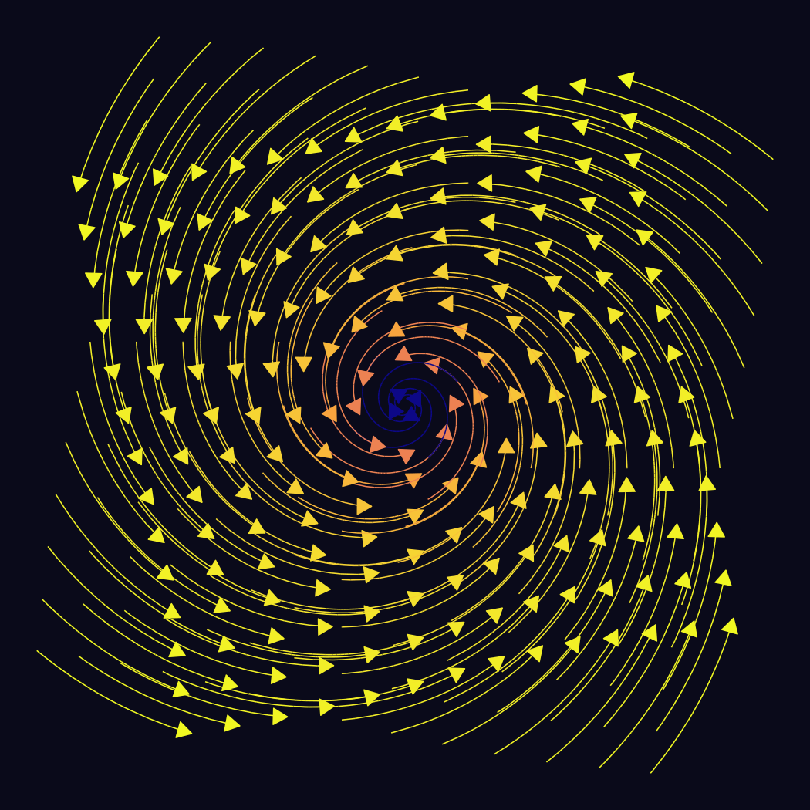

------------------------------------------------------------------------

## II. Sine Waves in Cross-Current

When `dx = sin(y)` and `dy = cos(x)`, the result is a mesmerizing
lattice of recirculating cells – reminiscent of Rayleigh–B'enard
convection.

``` r
convection <- function(v) c(sin(v[2]), cos(v[1]))

ggplot() +
  geom_stream_field(fun = convection,
                    xlim = c(-2*pi, 2*pi), ylim = c(-2*pi, 2*pi),
                    n = 12, L = 3, center = TRUE) +
  scale_color_gradientn(
    colors = c("#001219", "#005f73", "#0a9396", "#94d2bd",
                "#e9d8a6", "#ee9b00", "#ca6702", "#bb3e03", "#9b2226"),
    guide = "none"
  ) +
  coord_equal() +
  theme_void() +
  theme(plot.background = element_rect(fill = "#001219", color = NA))
```


------------------------------------------------------------------------

## III. Twin Galaxies

Two competing rotational centers, each with its own spiral. Where their
influence overlaps, the flow distorts and braids.

``` r
twin_galaxies <- function(v) {
  x <- v[1]; y <- v[2]
  # Galaxy 1 at (-2, 0)
  dx1 <- x + 2; dy1 <- y
  r1 <- sqrt(dx1^2 + dy1^2) + 0.1
  # Galaxy 2 at (2, 0)
  dx2 <- x - 2; dy2 <- y
  r2 <- sqrt(dx2^2 + dy2^2) + 0.1
  # Spiral: rotation + slight inward pull
  u1 <- (-dy1 / r1 - 0.2 * dx1 / r1) * exp(-r1 / 4)
  v1 <- ( dx1 / r1 - 0.2 * dy1 / r1) * exp(-r1 / 4)
  u2 <- ( dy2 / r2 + 0.2 * dx2 / r2) * exp(-r2 / 4)
  v2 <- (-dx2 / r2 + 0.2 * dy2 / r2) * exp(-r2 / 4)
  c(u1 + u2, v1 + v2)
}

ggplot() +
  geom_stream_field(fun = twin_galaxies,
                    xlim = c(-6, 6), ylim = c(-5, 5),
                    n = 12, L = 3.5, center = TRUE) +
  scale_color_gradientn(
    colors = c("#2d004b", "#542788", "#8073ac", "#b2abd2",
                "#f7f7f7", "#fdb863", "#e08214", "#b35806", "#7f3b08"),
    guide = "none"
  ) +
  coord_equal() +
  theme_void() +
  theme(plot.background = element_rect(fill = "#0d0d1a", color = NA))
```

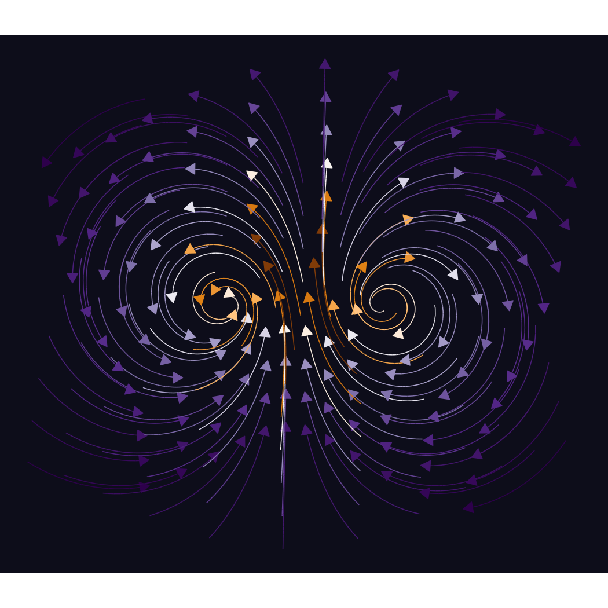

------------------------------------------------------------------------

## IV. The Dipole

The classic electromagnetic dipole: a positive charge and a negative
charge. Field lines arc gracefully from source to sink. This uses the
built-in [`efield_maker()`](/reference/efield.md) function.

``` r
dipole <- function(v) {
  pos <- rbind(c(-1, -1), c(1, 1))
  q <- c(-1, 1)
  Fx <- 0; Fy <- 0
  for (i in 1:2) {
    dx <- v[1] - pos[i, 1]; dy <- v[2] - pos[i, 2]
    r <- max(sqrt(dx^2 + dy^2), 0.4)
    Fx <- Fx + q[i] * dx / r^3
    Fy <- Fy + q[i] * dy / r^3
  }
  mag <- sqrt(Fx^2 + Fy^2)
  log(mag + 1) / (mag + 1e-8) * c(Fx, Fy)
}

ggplot() +
  geom_stream_field(fun = dipole,
                    xlim = c(-3, 3), ylim = c(-3, 3),
                    n = 12, L = 2, center = TRUE) +
  scale_color_gradientn(
    colors = c("#f7fcf5", "#c7e9c0", "#74c476", "#238b45", "#00441b"),
    guide = "none"
  ) +
  annotate("point", x = c(-1, 1), y = c(-1, 1), size = 5,
           color = c("#e41a1c", "#377eb8")) +
  annotate("text", x = c(-1, 1), y = c(-1.4, 1.4),
           label = c("\u2212", "+"), size = 8,
           color = c("#e41a1c", "#377eb8")) +
  coord_equal() +
  theme_void() +
  theme(plot.background = element_rect(fill = "#f7fcf5", color = NA))
```

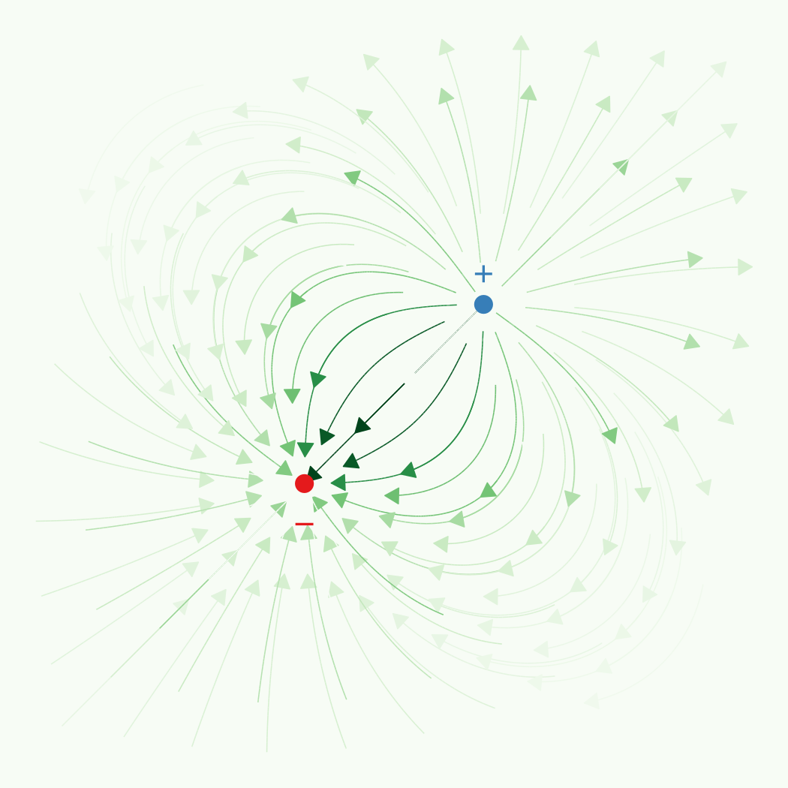

------------------------------------------------------------------------

## V. Quadrupole Constellation

Four charges arranged at the corners of a square create a beautifully
symmetric field with saddle points and intricate flow topology.

``` r
quad_field <- function(v) {
  charges <- rbind(c(-1.5, -1.5), c(1.5, -1.5), c(-1.5, 1.5), c(1.5, 1.5))
  q <- c(1, -1, -1, 1)
  efield(v, charges, q, log = TRUE)
}

ggplot() +
  geom_stream_field(fun = quad_field,
                    xlim = c(-4, 4), ylim = c(-4, 4),
                    n = 10, L = 2, center = TRUE) +
  scale_color_gradientn(
    colors = c("#440154", "#31688e", "#35b779", "#fde725"),
    guide = "none"
  ) +
  annotate("point",
    x = c(-1.5, 1.5, -1.5, 1.5),
    y = c(-1.5, -1.5, 1.5, 1.5),
    color = c("#ff6b6b", "#4ecdc4", "#4ecdc4", "#ff6b6b"), size = 4
  ) +
  coord_equal() +
  theme_void() +
  theme(plot.background = element_rect(fill = "#1a1a2e", color = NA))
```


------------------------------------------------------------------------

## VI. Vectors Meet Streams

The same field visualized two ways, side by side in a single plot.
Vectors show local direction and magnitude; streams reveal the global
flow topology.

``` r
saddle_spiral <- function(v) {
  x <- v[1]; y <- v[2]
  c(x - 0.5*y, -y - 0.5*x)
}

ggplot() +
  geom_vector_field(fun = saddle_spiral,
                    xlim = c(-3, -0.2), ylim = c(-3, 3),
                    n = 10) +
  geom_stream_field(fun = saddle_spiral,
                    xlim = c(0.2, 3), ylim = c(-3, 3),
                    n = 10, L = 1.5, center = TRUE) +
  annotate("text", x = -1.6, y = -2.8, label = "Vector Field",
           color = "grey70", size = 4, fontface = "italic") +
  annotate("text", x = 1.6, y = -2.8, label = "Stream Field",
           color = "grey70", size = 4, fontface = "italic") +
  scale_color_gradientn(
    colors = c("#2196F3", "#E91E63"),
    guide = "none"
  ) +
  coord_equal() +
  theme_void() +
  theme(plot.background = element_rect(fill = "#121212", color = NA))
```

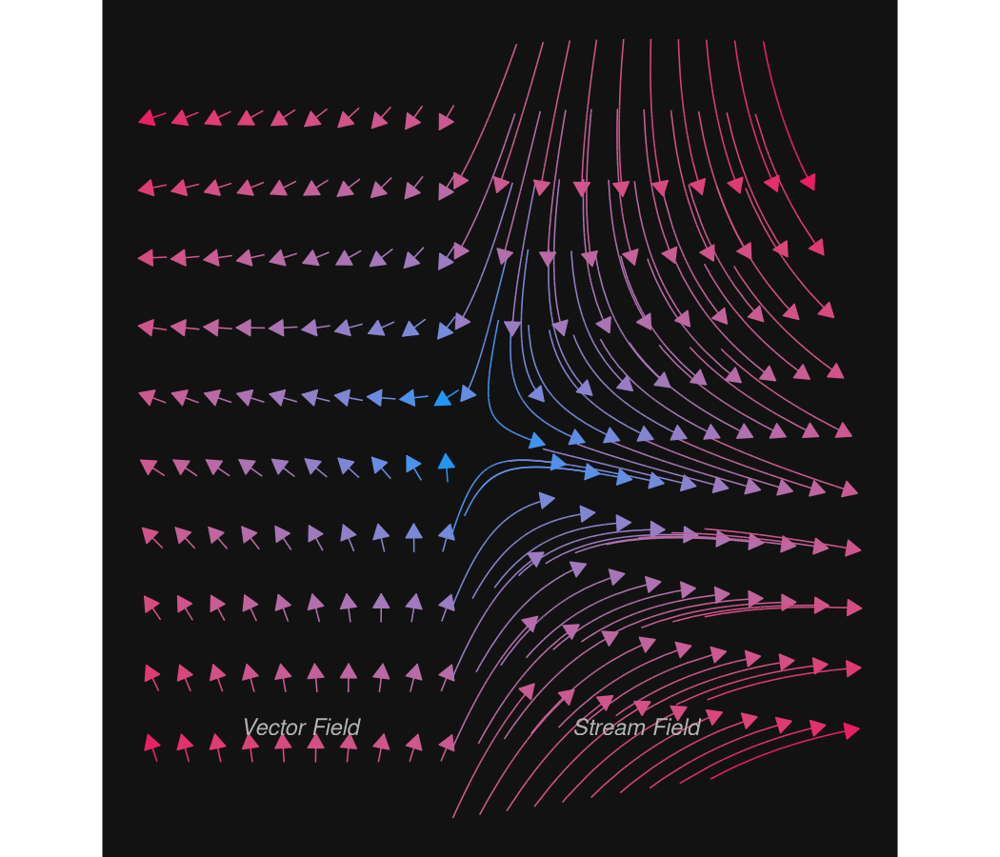

------------------------------------------------------------------------

## VII. Topographic Gradient

A scalar function defines a landscape. Its gradient points uphill. Here,
the potential surface is rendered as a filled contour beneath the
gradient arrows.

``` r
landscape <- function(v) {
  x <- v[1]; y <- v[2]
  sin(x) * cos(y) + 0.5 * cos(2*x - y)
}

ggplot() +
  geom_potential(fun = \(v) c(numDeriv::grad(landscape, v)),
                 xlim = c(-pi, pi), ylim = c(-pi, pi), n = 51) +
  geom_gradient_field(fun = landscape,
                      xlim = c(-pi, pi), ylim = c(-pi, pi),
                      n = 12, type = "vector") +
  scale_fill_gradientn(
    colors = c("#313695", "#4575b4", "#74add1", "#abd9e9", "#e0f3f8",
                "#ffffbf", "#fee090", "#fdae61", "#f46d43", "#d73027", "#a50026"),
    guide = "none"
  ) +
  scale_color_gradientn(
    colors = c("grey20", "grey80"),
    guide = "none"
  ) +
  coord_equal() +
  theme_void() +
  theme(plot.background = element_rect(fill = "#313695", color = NA))
```


------------------------------------------------------------------------

## VIII. Hexagonal Flow

Hexagonal grids break the visual monotony of rectangular layouts,
revealing patterns that axis-aligned grids can miss.

``` r
shear_rotation <- function(v) {
  x <- v[1]; y <- v[2]
  c(sin(y + x), cos(x - y))
}

ggplot() +
  geom_vector_field(fun = shear_rotation,
                    xlim = c(-4, 4), ylim = c(-4, 4),
                    grid = "hex", n = 14) +
  scale_color_gradientn(
    colors = c("#ff006e", "#fb5607", "#ffbe0b", "#3a86ff", "#8338ec"),
    guide = "none"
  ) +
  coord_equal() +
  theme_void() +
  theme(plot.background = element_rect(fill = "#0b090a", color = NA))
```

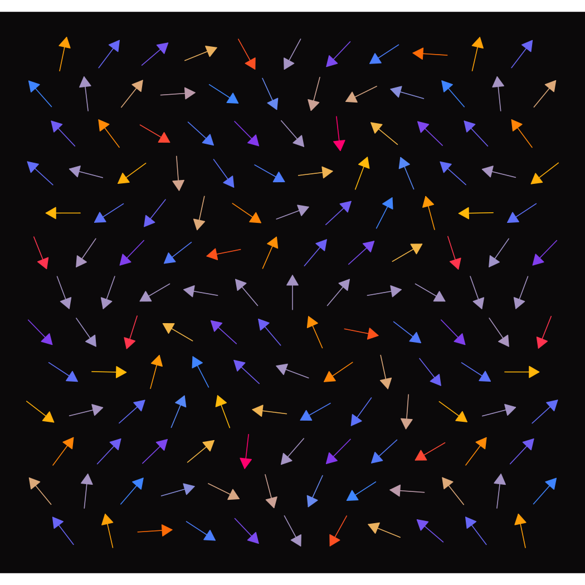

------------------------------------------------------------------------

## IX. The Lorenz Slice

The Lorenz system lives in three dimensions, but we can slice it. Fixing
`z = 27` (near the classic attractor) and plotting the `(x, y)` dynamics
produces a hauntingly beautiful single-wing flow.

``` r
lorenz_xy <- function(v, sigma = 10, rho = 28, beta = 8/3, z0 = 27) {
  x <- v[1]; y <- v[2]
  dx <- sigma * (y - x)
  dy <- x * (rho - z0) - y
  c(dx, dy)
}

ggplot() +
  geom_stream_field(fun = lorenz_xy,
                    xlim = c(-25, 25), ylim = c(-30, 30),
                    n = 12, L = 8, center = TRUE) +
  scale_color_gradientn(
    colors = c("#03071e", "#370617", "#6a040f", "#9d0208",
                "#d00000", "#dc2f02", "#e85d04", "#f48c06",
                "#faa307", "#ffba08"),
    guide = "none"
  ) +
  coord_equal() +
  theme_void() +
  theme(plot.background = element_rect(fill = "#03071e", color = NA))
```

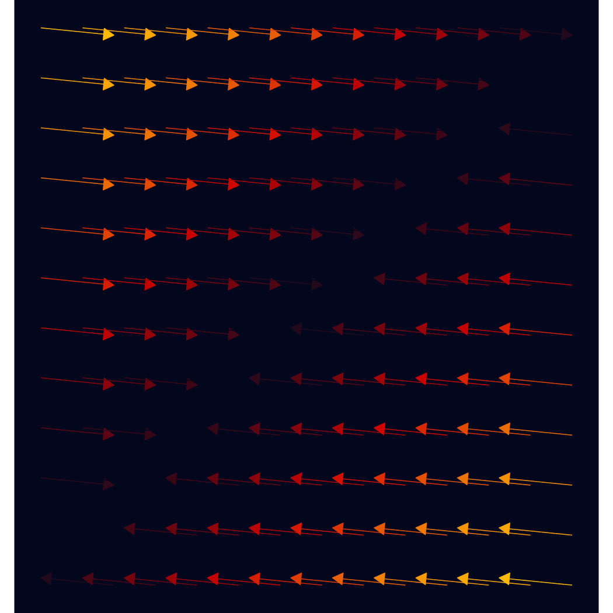

------------------------------------------------------------------------

## X. Predator and Prey

The Lotka–Volterra equations describe the eternal dance between predator
and prey populations. The flow orbits endlessly around the equilibrium –
no species wins, no species loses.

``` r
lotka_volterra <- function(v, alpha = 1.1, beta = 0.4,
                           delta = 0.1, gamma = 0.4) {
  x <- v[1]; y <- v[2]
  dx <- alpha * x - beta * x * y
  dy <- delta * x * y - gamma * y
  c(dx, dy)
}

ggplot() +
  geom_stream_field(fun = lotka_volterra,
                    xlim = c(0.2, 8), ylim = c(0.2, 6),
                    n = 12, L = 2.5, center = TRUE) +
  scale_color_gradientn(
    colors = c("#264653", "#2a9d8f", "#e9c46a", "#f4a261", "#e76f51"),
    guide = "none"
  ) +
  annotate("point", x = 4, y = 2.75, size = 4, color = "white", shape = 4,
           stroke = 1.5) +
  labs(x = "Prey", y = "Predator") +
  theme_minimal(base_size = 14) +
  theme(
    plot.background = element_rect(fill = "#1d3557", color = NA),
    panel.grid = element_line(color = "#1d355730"),
    axis.text = element_text(color = "grey70"),
    axis.title = element_text(color = "grey80")
  )
```


------------------------------------------------------------------------

## XI. Magnitude as Length

[`geom_vector_field2()`](/reference/geom_vector_field.md) maps the norm
to *length* rather than color, letting you see both direction and
magnitude at a glance without a color scale.

``` r
stretching <- function(v) {
  x <- v[1]; y <- v[2]
  c(x * cos(y), y * sin(x))
}

ggplot() +
  geom_vector_field2(fun = stretching,
                     xlim = c(-pi, pi), ylim = c(-pi, pi),
                     n = 16, normalize = FALSE) +
  coord_equal() +
  theme_void() +
  theme(plot.background = element_rect(fill = "#faf9f6", color = NA))
```


------------------------------------------------------------------------

## XII. Smoothing the Storm

Real-world data is noisy.
[`geom_vector_smooth()`](/reference/geom_vector_smooth.md) fits a model
– here a GAM – to recover the underlying flow from scattered, imperfect
measurements.

``` r
# Generate noisy observations from a known field
set.seed(42)
n_obs <- 120
pts <- data.frame(
  x = rnorm(n_obs, 0, 1.2),
  y = rnorm(n_obs, 0, 1.2)
)
true_field <- function(v) c(-v[2], v[1])  # pure rotation
pts$fx <- sapply(1:n_obs, \(i) true_field(c(pts$x[i], pts$y[i]))[1]) + rnorm(n_obs, 0, 1.5)
pts$fy <- sapply(1:n_obs, \(i) true_field(c(pts$x[i], pts$y[i]))[2]) + rnorm(n_obs, 0, 1.5)

ggplot(pts, aes(x = x, y = y, fx = fx, fy = fy)) +
  geom_vector_smooth(method = "gam", se = TRUE, pi_type = "wedge",
                     conf_level = 0.90, n = 10) +
  geom_vector2(color = "grey50", alpha = 0.4) +
  scale_color_gradientn(
    colors = c("#48cae4", "#0077b6", "#023e8a"),
    guide = "none"
  ) +
  coord_equal() +
  labs(title = "GAM-Smoothed Flow from Noisy Observations",
       subtitle = "Raw observations shown in grey") +
  theme_minimal(base_size = 13) +
  theme(
    plot.background = element_rect(fill = "#caf0f8", color = NA),
    panel.grid = element_line(color = "#caf0f860"),
    plot.title = element_text(color = "#023e8a", face = "bold"),
    plot.subtitle = element_text(color = "#0077b6")
  )
```

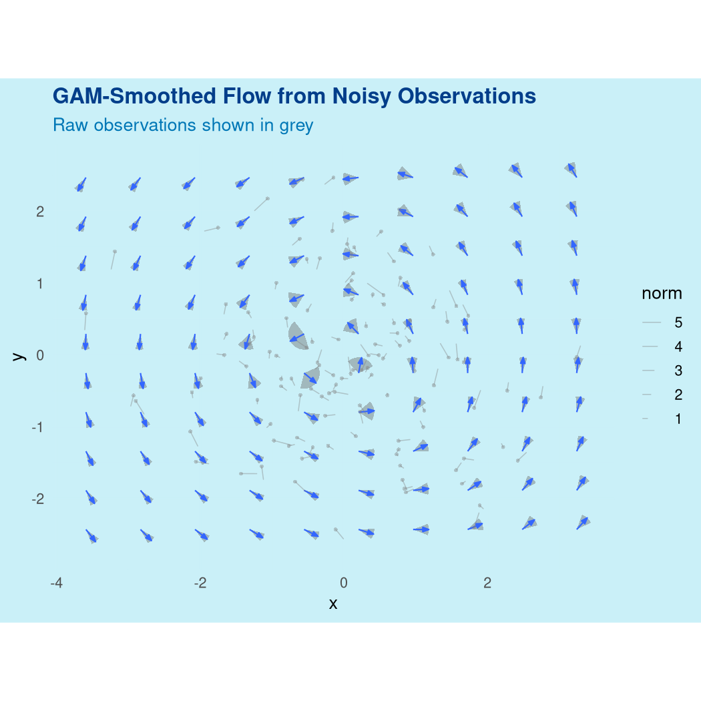

------------------------------------------------------------------------

## XIII. The Gradient Landscape with Streams

Instead of arrows, trace streams *downhill* through a scalar landscape.
The streams follow the negative gradient, pooling in basins like
rainwater.

``` r
peaks <- function(v) {
  x <- v[1]; y <- v[2]
  3*(1-x)^2 * exp(-x^2 - (y+1)^2) -
  10*(x/5 - x^3 - y^5) * exp(-x^2 - y^2) -
  1/3 * exp(-(x+1)^2 - y^2)
}

neg_grad <- function(v) {
  x <- v[1]; y <- v[2]
  e1 <- exp(-x^2 - (y + 1)^2)
  e2 <- exp(-x^2 - y^2)
  e3 <- exp(-(x + 1)^2 - y^2)
  dfdx <- 3 * e1 * (-2*(1-x) - 2*x*(1-x)^2) +
    -10 * e2 * ((1/5 - 3*x^2) - 2*x*(x/5 - x^3 - y^5)) +
    (2/3)*(x+1) * e3
  dfdy <- -6*(1-x)^2*(y+1) * e1 +
    -10 * e2 * (-5*y^4 - 2*y*(x/5 - x^3 - y^5)) +
    (2/3)*y * e3
  -c(dfdx, dfdy)
}

ggplot() +
  geom_potential(fun = \(v) numDeriv::grad(peaks, v),
                 xlim = c(-3, 3), ylim = c(-3, 3), n = 51) +
  geom_stream_field(fun = neg_grad,
                    xlim = c(-3, 3), ylim = c(-3, 3),
                    n = 12, L = 1.5, center = FALSE) +
  scale_fill_gradientn(
    colors = c("#3d0066", "#6a0dad", "#9b5de5", "#f15bb5",
                "#fee440", "#00f5d4"),
    guide = "none"
  ) +
  scale_color_gradientn(
    colors = c("white", "grey80"),
    guide = "none"
  ) +
  coord_equal() +
  theme_void() +
  theme(plot.background = element_rect(fill = "#1a002e", color = NA))
```


------------------------------------------------------------------------

## XIV. Pendulum Phase Portrait

The simple pendulum has a rich phase space: closed orbits for swinging,
open trajectories for spinning, and saddle points at the unstable
equilibrium. This is one of the most beautiful objects in classical
mechanics.

``` r
pendulum <- function(v) {
  theta <- v[1]; omega <- v[2]
  c(omega, -sin(theta))
}

ggplot() +
  geom_stream_field(fun = pendulum,
                    xlim = c(-2*pi, 2*pi), ylim = c(-3, 3),
                    n = 14, L = 2.5, center = TRUE) +
  scale_color_gradientn(
    colors = c("#1b4332", "#2d6a4f", "#40916c", "#52b788",
                "#74c69d", "#95d5b2", "#b7e4c7", "#d8f3dc"),
    guide = "none"
  ) +
  labs(x = expression(theta), y = expression(dot(theta))) +
  theme_minimal(base_size = 14) +
  theme(
    plot.background = element_rect(fill = "#0b1e14", color = NA),
    panel.grid = element_line(color = "#1b433240"),
    axis.text = element_text(color = "#74c69d"),
    axis.title = element_text(color = "#95d5b2", size = 16)
  )
```

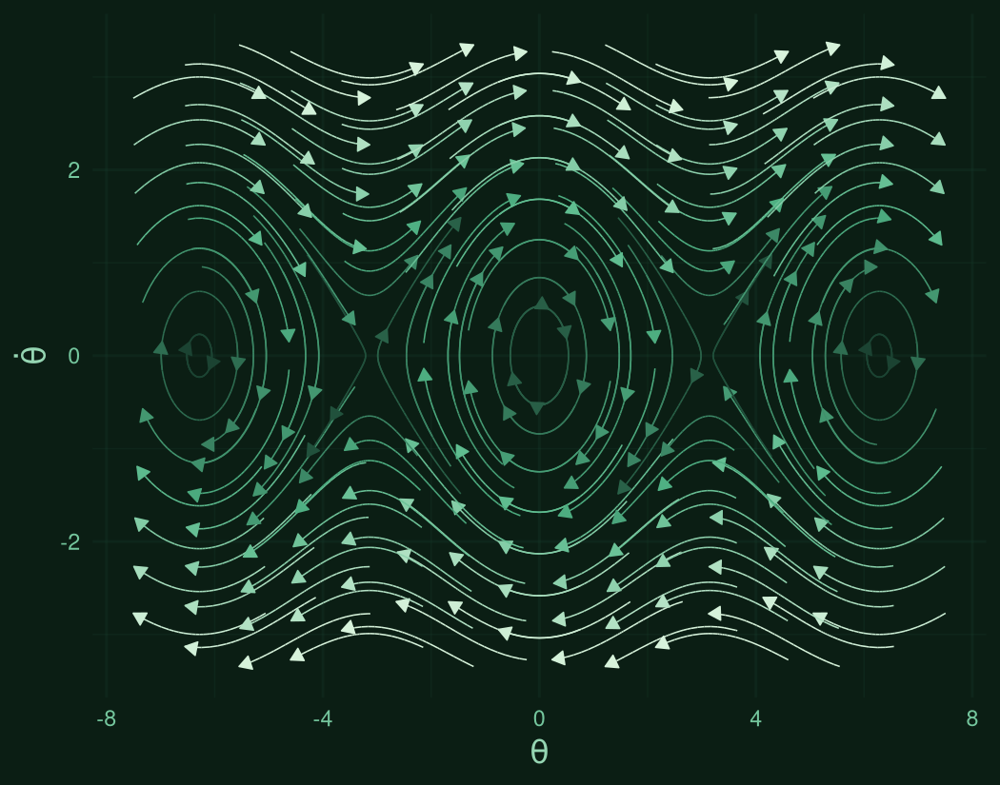

------------------------------------------------------------------------

## XV. Stained Glass

Some vector fields are simply beautiful for their own sake. No physics
required – just mathematics painting in color.

``` r
stained <- function(v) {
  x <- v[1]; y <- v[2]
  c(sin(x*y) + cos(y^2), cos(x^2) - sin(x*y))
}

ggplot() +
  geom_stream_field(fun = stained,
                    xlim = c(-3, 3), ylim = c(-3, 3),
                    n = 14, L = 2, center = TRUE) +
  scale_color_gradientn(
    colors = c("#ff0a54", "#ff477e", "#ff7096", "#ff85a1",
                "#fbb1bd", "#f9bec7", "#ff85a1", "#ff477e",
                "#ff0a54", "#c9184a", "#a4133c", "#800f2f"),
    guide = "none"
  ) +
  coord_equal() +
  theme_void() +
  theme(plot.background = element_rect(fill = "#fff0f3", color = NA))
```


------------------------------------------------------------------------

## XVI. Five-Charge Constellation

An arrangement of five alternating charges creates a symmetric field
with rich topology – a visual reminiscent of the aurora borealis.

``` r
five_charge <- function(v) {
  # Pentagon arrangement
  angles <- seq(0, 2*pi, length.out = 6)[-6]
  r <- 2.5
  charges <- cbind(r * cos(angles), r * sin(angles))
  q <- c(1, -1, 1, -1, 1)
  efield(v, charges, q, log = TRUE)
}

ggplot() +
  geom_stream_field(fun = five_charge,
                    xlim = c(-5, 5), ylim = c(-5, 5),
                    n = 10, L = 2, center = TRUE) +
  scale_color_gradientn(
    colors = c("#0d1b2a", "#1b263b", "#415a77", "#778da9", "#e0e1dd"),
    guide = "none"
  ) +
  coord_equal() +
  theme_void() +
  theme(plot.background = element_rect(fill = "#0d1b2a", color = NA))
```

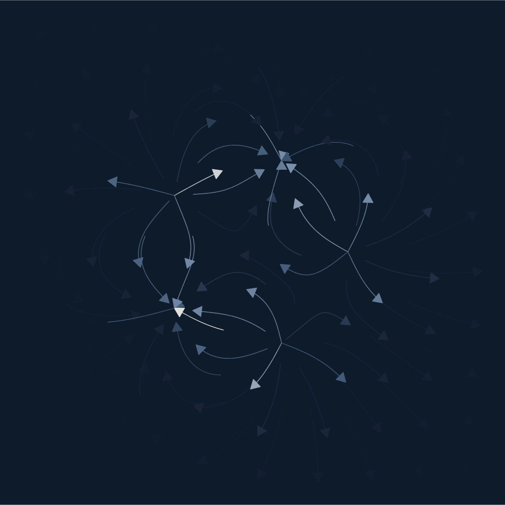

------------------------------------------------------------------------

## XVII. Layered: Potential + Vectors + Streams

The most expressive plots combine multiple layers. Here a potential
surface, vector arrows, and stream lines all work together.

``` r
conservative <- function(v) {
  x <- v[1]; y <- v[2]
  c(2*x, 2*y)  # gradient of x^2 + y^2
}

ggplot() +
  geom_potential(fun = conservative,
                 xlim = c(-3, 3), ylim = c(-3, 3), n = 51) +
  geom_vector_field(fun = conservative,
                    xlim = c(-3, 3), ylim = c(-3, 3),
                    n = 8, arrow = arrow(length = unit(0.15, "cm"))) +
  geom_stream_field(fun = conservative,
                    xlim = c(-3, 3), ylim = c(-3, 3),
                    n = 12, L = 1.5, center = FALSE,
                    color = "white", alpha = 0.3) +
  scale_fill_gradientn(
    colors = c("#000004", "#1b0c41", "#4a0c6b", "#781c6d",
                "#a52c60", "#cf4446", "#ed6925", "#fb9b06",
                "#f7d13d", "#fcffa4"),
    guide = "none"
  ) +
  scale_color_gradientn(
    colors = c("#fcffa4", "#fb9b06", "#cf4446"),
    guide = "none"
  ) +
  coord_equal() +
  theme_void() +
  theme(plot.background = element_rect(fill = "#000004", color = NA))
```

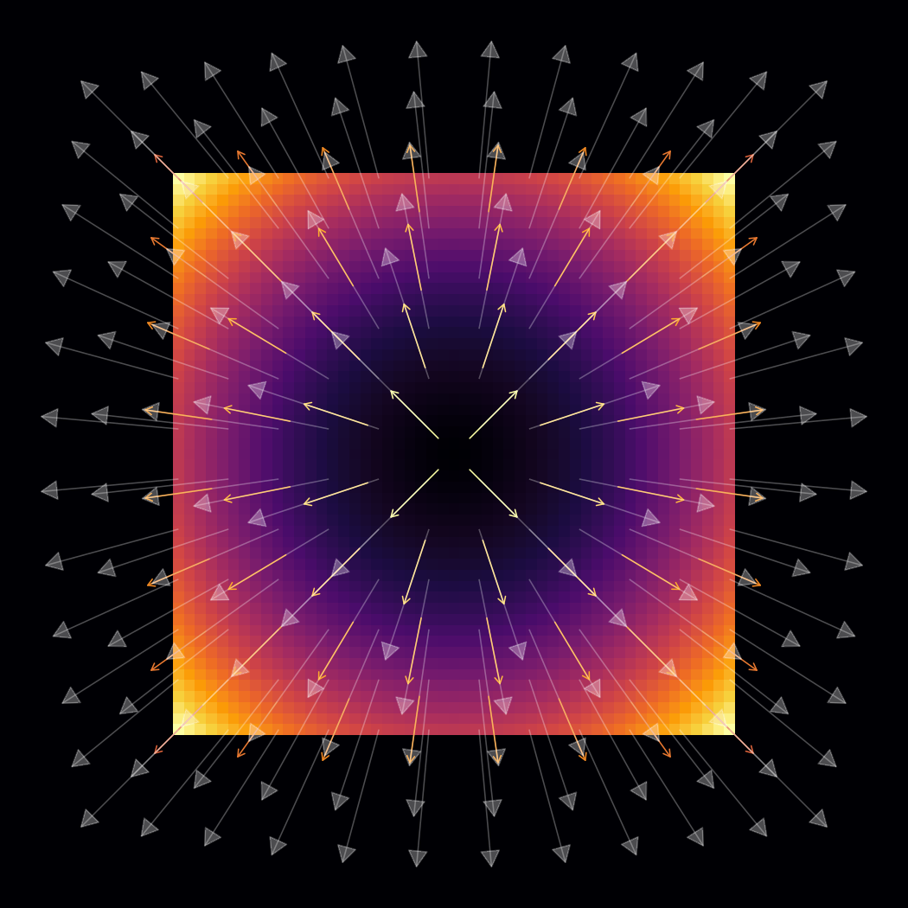

------------------------------------------------------------------------

## XVIII. Van der Pol Limit Cycle

The Van der Pol oscillator relaxes to a stable limit cycle – a lone
closed orbit that swallows every nearby trajectory. The pink-to-cyan
gradient traces each streamline’s arc as it spirals inward or outward
toward the cycle.

``` r
van_der_pol <- function(v, mu = 1.5) {
  x <- v[1]; y <- v[2]
  c(y, mu * (1 - x^2) * y - x)
}

ggplot() +
  geom_stream_field(fun = van_der_pol,
                    xlim = c(-4, 4), ylim = c(-6, 6),
                    n = 12, L = 4) +
  scale_color_gradientn(
    colors = c("#f72585", "#b5179e", "#7209b7", "#560bad",
               "#480ca8", "#3a0ca3", "#3f37c9", "#4361ee",
               "#4895ef", "#4cc9f0"),
    guide = "none"
  ) +
  coord_equal() +
  theme_void() +
  theme(plot.background = element_rect(fill = "#10002b", color = NA))
```

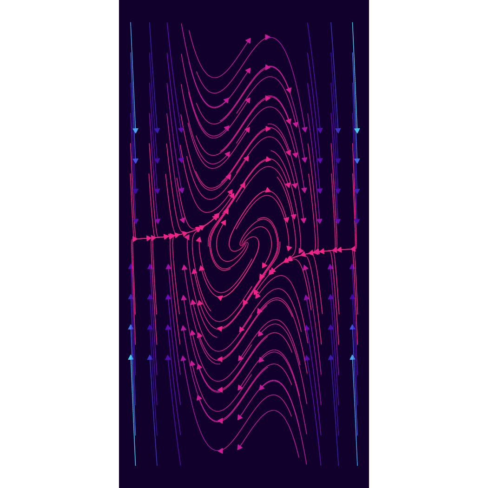

------------------------------------------------------------------------

## XIX. Flow Past a Cylinder

Potential flow around a circular obstacle – the canonical illustration
of inviscid fluid dynamics. Streamlines compress where the fluid
accelerates past the cylinder’s shoulders.

``` r
cylinder_flow <- function(v, R = 1, U = 1) {
  x <- v[1]; y <- v[2]
  r2 <- x^2 + y^2
  if (r2 < R^2) return(c(0, 0))
  r4 <- r2^2
  u <- U * (1 - R^2 * (x^2 - y^2) / r4)
  w <- -U * 2 * R^2 * x * y / r4
  c(u, w)
}

theta_cyl <- seq(0, 2 * pi, length.out = 200)
cyl <- data.frame(x = cos(theta_cyl), y = sin(theta_cyl))

ggplot() +
  geom_stream_field(fun = cylinder_flow,
                    xlim = c(-4, 4), ylim = c(-3, 3),
                    n = 14, L = 3, center = FALSE) +
  geom_polygon(data = cyl, aes(x = x, y = y),
               fill = "#2b2d42", color = "#8d99ae", linewidth = 0.5) +
  scale_color_gradientn(
    colors = c("#caf0f8", "#90e0ef", "#00b4d8", "#0077b6", "#03045e"),
    guide = "none"
  ) +
  coord_equal() +
  theme_void() +
  theme(plot.background = element_rect(fill = "#03045e", color = NA))
```

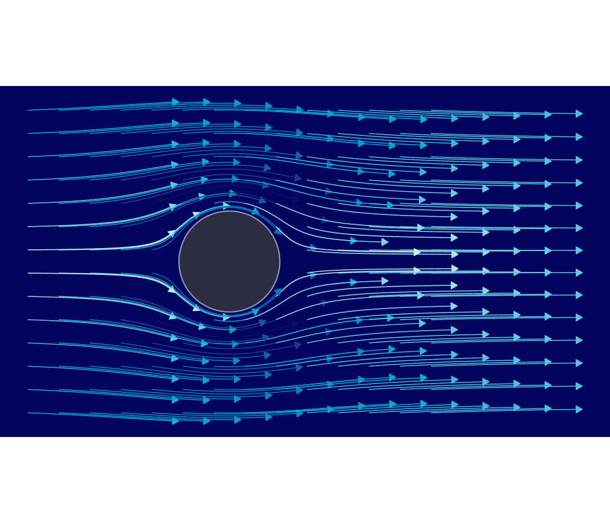

------------------------------------------------------------------------

## XX. The Duffing Double Well

Two stable equilibria flanking an unstable saddle. Trajectories loop
around one well or the other – or, with enough energy, orbit both. A
portrait of bistability.

``` r
duffing <- function(v) {
  x <- v[1]; y <- v[2]
  c(y, x - x^3 - 0.15 * y)
}

ggplot() +
  geom_stream_field(fun = duffing,
                    xlim = c(-2.5, 2.5), ylim = c(-2.5, 2.5),
                    n = 14, L = 3, center = TRUE) +
  annotate("point", x = c(-1, 0, 1), y = c(0, 0, 0),
           color = c("#06d6a0", "#ef476f", "#06d6a0"),
           size = c(3, 4, 3), shape = c(16, 4, 16)) +
  scale_color_gradientn(
    colors = c("#073b4c", "#118ab2", "#06d6a0", "#ffd166", "#ef476f"),
    guide = "none"
  ) +
  coord_equal() +
  theme_void() +
  theme(plot.background = element_rect(fill = "#073b4c", color = NA))
```

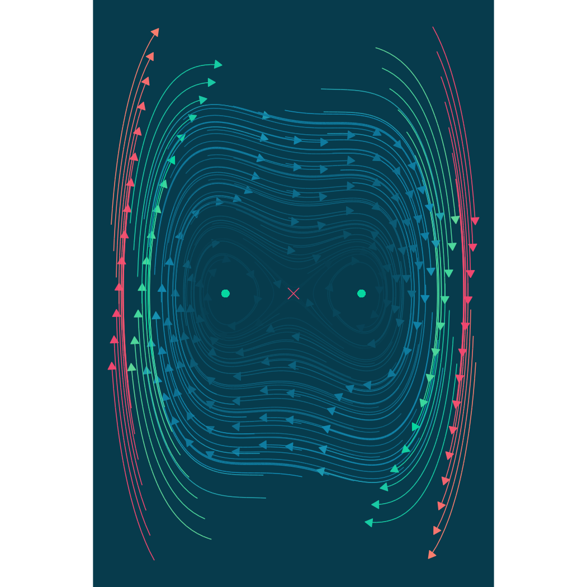

------------------------------------------------------------------------

## XXI. Smoothed Streamlines from Noisy Measurements

Real sensors give noisy readings.
[`geom_stream_smooth()`](/reference/geom_stream_smooth.md) fits a model
to scattered vector observations and integrates the predicted field into
clean streamlines – recovering the true flow from imperfect data.

``` r
set.seed(123)
n_obs <- 150
pts_ss <- data.frame(
  x = runif(n_obs, -3, 3),
  y = runif(n_obs, -3, 3)
)
# True field: a saddle with rotation
true_flow <- function(v) c(v[1] - 0.5 * v[2], -v[2] + 0.5 * v[1])
pts_ss$fx <- sapply(1:n_obs, \(i) true_flow(c(pts_ss$x[i], pts_ss$y[i]))[1]) +
  rnorm(n_obs, 0, 0.8)
pts_ss$fy <- sapply(1:n_obs, \(i) true_flow(c(pts_ss$x[i], pts_ss$y[i]))[2]) +
  rnorm(n_obs, 0, 0.8)

ggplot(pts_ss, aes(x = x, y = y, fx = fx, fy = fy)) +
  geom_stream_smooth(method = "gam", n = 10, L = 1.5, center = TRUE) +
  geom_vector2(color = "#d8f3dc", alpha = 0.25) +
  scale_color_gradientn(
    colors = c("#52b788", "#40916c", "#2d6a4f", "#1b4332", "#081c15"),
    guide = "none"
  ) +
  coord_equal() +
  labs(title = "GAM-Smoothed Streamlines",
       subtitle = "Raw noisy observations shown as faint arrows") +
  theme_minimal(base_size = 13) +
  theme(
    plot.background = element_rect(fill = "#081c15", color = NA),
    panel.grid = element_line(color = "#1b433220"),
    plot.title = element_text(color = "#95d5b2", face = "bold"),
    plot.subtitle = element_text(color = "#52b788"),
    axis.text = element_blank(),
    axis.title = element_blank()
  )
```


------------------------------------------------------------------------

## XXII. Sculpted Terrain

Given scattered elevation readings,
[`geom_gradient_smooth()`](/reference/geom_gradient_smooth.md) fits a
surface and draws its gradient – arrows pointing uphill, tracing the
steepest ascent across a landscape you can almost feel underfoot.

``` r
set.seed(7)
terrain <- data.frame(
  x = runif(300, -3, 3),
  y = runif(300, -3, 3)
)
terrain$z <- with(terrain,
  2 * exp(-((x - 1)^2 + (y - 1)^2)) -
  1.5 * exp(-((x + 1.5)^2 + (y + 1)^2) / 2) +
  0.2 * rnorm(300)
)

# Fit the surface and predict on a grid for the background
fit <- lm(z ~ poly(x, 4) * poly(y, 4), data = terrain)
bg_grid <- expand.grid(
  x = seq(-3, 3, length.out = 80),
  y = seq(-3, 3, length.out = 80)
)
bg_grid$z <- predict(fit, bg_grid)

ggplot(terrain, aes(x = x, y = y, z = z)) +
  geom_raster(data = bg_grid, aes(x = x, y = y, fill = z), inherit.aes = FALSE) +
  geom_gradient_smooth(
    formula = z ~ poly(x, 4) * poly(y, 4),
    n = 10, type = "vector"
  ) +
  scale_fill_gradientn(
    colors = c("#283618", "#606c38", "#a3b18a", "#fefae0", "#dda15e", "#bc6c25"),
    guide = "none"
  ) +
  scale_color_gradientn(
    colors = c("grey20", "grey90"),
    guide = "none"
  ) +
  coord_equal() +
  labs(title = "Gradient of Smoothed Elevation",
       subtitle = "Arrows point uphill across a fitted terrain surface") +
  theme_minimal(base_size = 13) +
  theme(
    plot.background = element_rect(fill = "#1a1a0e", color = NA),
    panel.grid = element_line(color = "#28361820"),
    plot.title = element_text(color = "#fefae0", face = "bold"),
    plot.subtitle = element_text(color = "#dda15e"),
    axis.text = element_text(color = "#606c38"),
    axis.title = element_blank()
  )
```

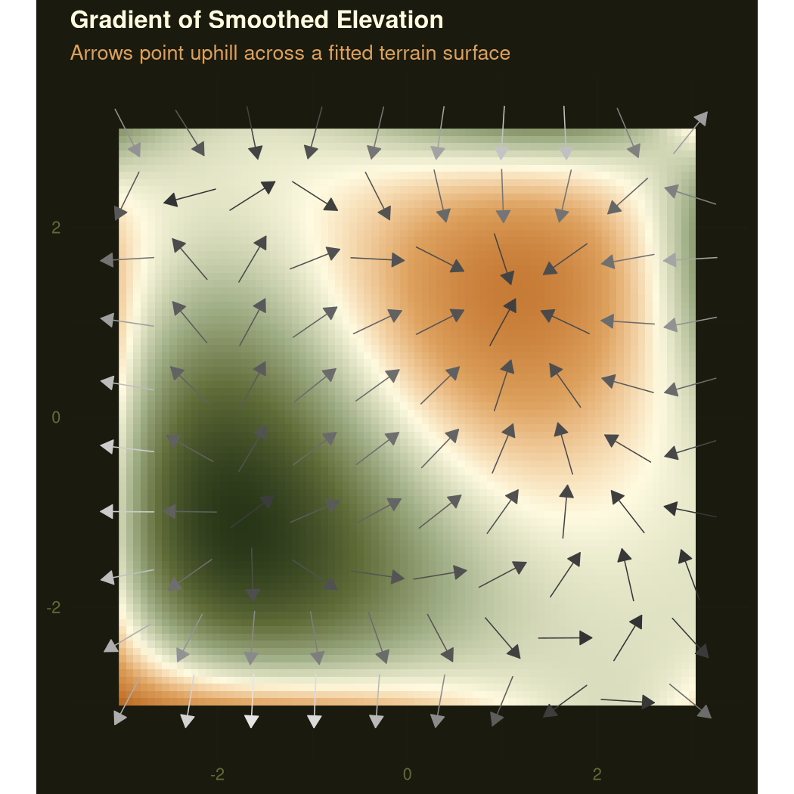

------------------------------------------------------------------------

## XXIII. Magnitude by Length

[`geom_vector_field2()`](/reference/geom_vector_field.md) encodes
magnitude as arrow *length* rather than color. Paired with
[`scale_length_continuous()`](/reference/scale_length_continuous.md),
you get fine control over how loudly each region of the field speaks.

``` r
source_sink <- function(v) {
  x <- v[1]; y <- v[2]
  r1 <- sqrt((x - 1.5)^2 + y^2) + 0.1
  r2 <- sqrt((x + 1.5)^2 + y^2) + 0.1
  c((x - 1.5) / r1^2 - (x + 1.5) / r2^2,
    y / r1^2 - y / r2^2)
}

ggplot() +
  geom_vector_field2(fun = source_sink,
                     xlim = c(-4, 4), ylim = c(-4, 4),
                     n = 16, normalize = FALSE) +
  scale_length_continuous(max_range = 0.4) +
  annotate("point", x = c(-1.5, 1.5), y = c(0, 0),
           color = c("#9b2226", "#005f73"), size = 5) +
  annotate("text", x = c(-1.5, 1.5), y = c(-0.7, -0.7),
           label = c("sink", "source"),
           color = c("#9b2226", "#005f73"), size = 4, fontface = "italic") +
  coord_equal() +
  theme_void() +
  theme(plot.background = element_rect(fill = "#faf9f6", color = NA))
```

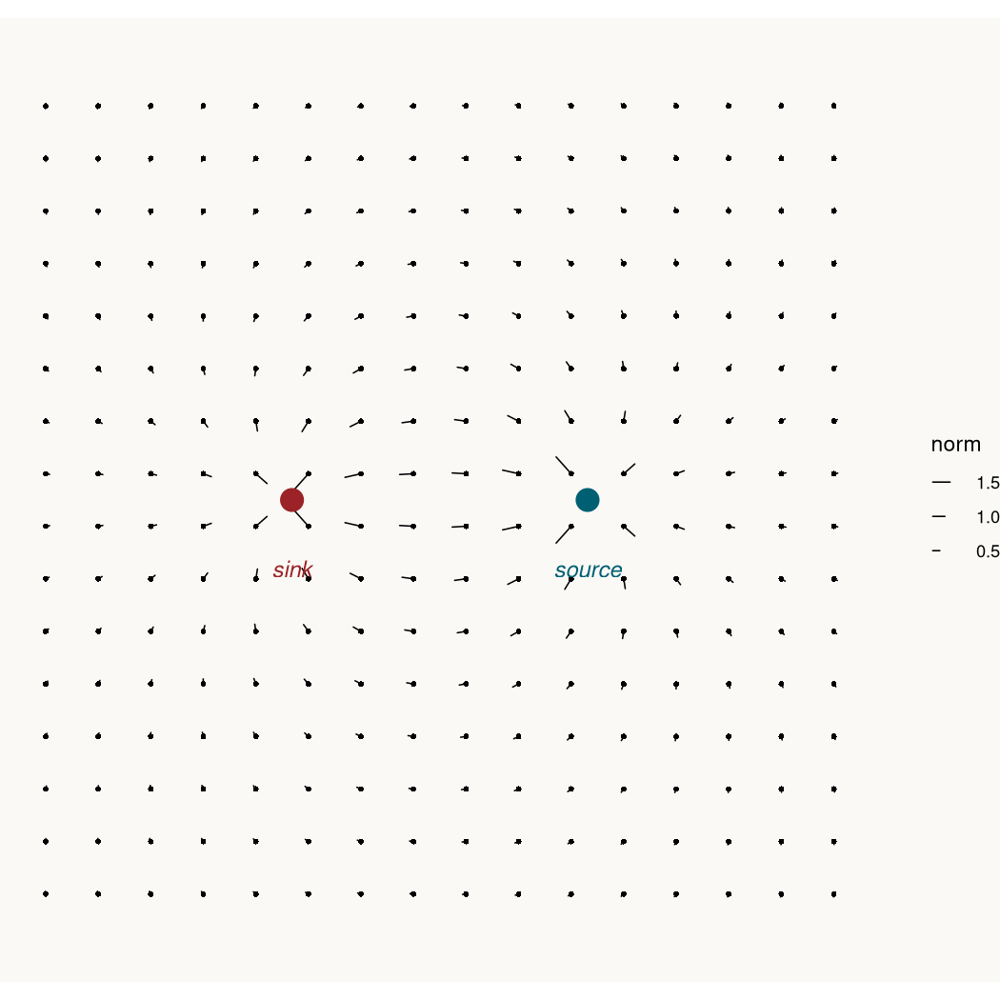

------------------------------------------------------------------------

## XXIV. Hand-Spun Spirals

Not every stream comes from a differential equation.
[`geom_stream()`](/reference/geom_stream.md) renders any ordered set of
points as a flowing curve with time-parameterised color – perfect for
custom, procedurally generated, or hand-crafted data.

``` r
make_spiral <- function(id, cx, cy, dir = 1, n_pts = 150) {
  s <- seq(0, 5 * pi, length.out = n_pts)
  r <- 0.05 + s / (5 * pi) * 2
  data.frame(
    x = cx + r * cos(dir * s),
    y = cy + r * sin(dir * s),
    t = seq(0, 1, length.out = n_pts),
    id = id
  )
}

spirals <- do.call(rbind, list(
  make_spiral(1,  0,    0,    1),
  make_spiral(2, -2.5,  2.5, -1),
  make_spiral(3,  2.5, -2.5,  1),
  make_spiral(4, -2.5, -2.5,  1),
  make_spiral(5,  2.5,  2.5, -1),
  make_spiral(6,  0,    3,   -1),
  make_spiral(7,  0,   -3,    1),
  make_spiral(8, -3,    0,    1),
  make_spiral(9,  3,    0,   -1)
))

ggplot(spirals, aes(x = x, y = y, t = t, group = id)) +
  geom_stream(linewidth = 0.6) +
  scale_color_gradientn(
    colors = c("#ffd6ff", "#e7c6ff", "#c8b6ff", "#b8c0ff", "#bbd0ff"),
    guide = "none"
  ) +
  coord_equal() +
  theme_void() +
  theme(plot.background = element_rect(fill = "#10002b", color = NA))
```

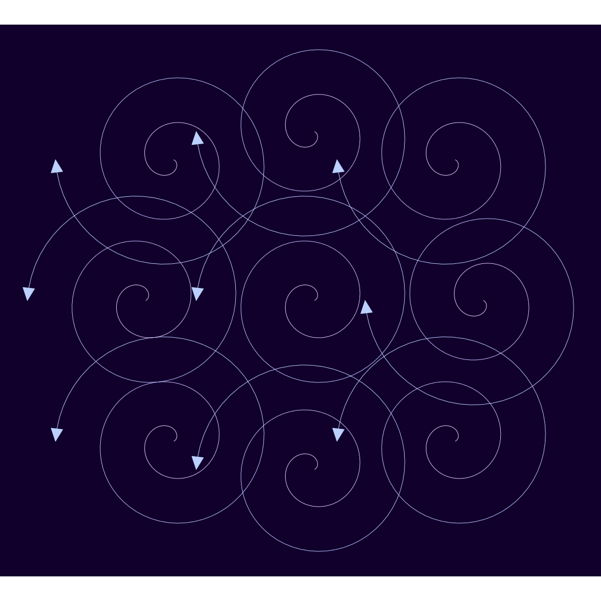

------------------------------------------------------------------------

## XXV. Complex Cosine

Map a complex-valued function into a 2D vector field: at each point
`z = x + iy`, the vector is the real and imaginary parts of `cos(z)`.
The zeros of cosine become fixed points, and the field between them
weaves a tapestry of hyperbolic arcs – complex analysis made visible.

``` r
cos_field <- function(v) {
  x <- v[1]; y <- v[2]
  c(cos(x) * cosh(y), -sin(x) * sinh(y))
}

ggplot() +
  geom_stream_field(fun = cos_field,
                    xlim = c(-2 * pi, 2 * pi), ylim = c(-3, 3),
                    n = 14, L = 2, center = TRUE) +
  scale_color_gradientn(
    colors = c("#001427", "#708d81", "#f4d58d", "#bf0603", "#8d0801"),
    guide = "none"
  ) +
  coord_equal() +
  theme_void() +
  theme(plot.background = element_rect(fill = "#001427", color = NA))
```


------------------------------------------------------------------------

Each of these plots was built with a handful of lines – that is the
power of **ggvfields**. Define a function, choose a geometry, pick your
colors, and let the mathematics flow.
